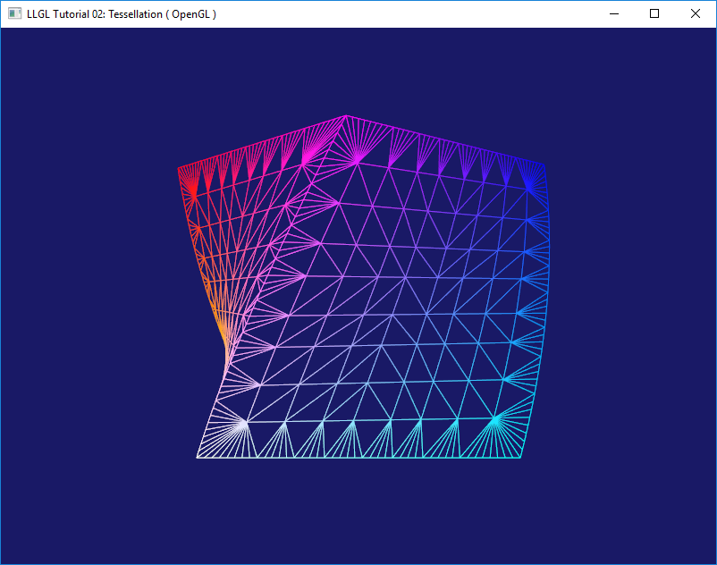
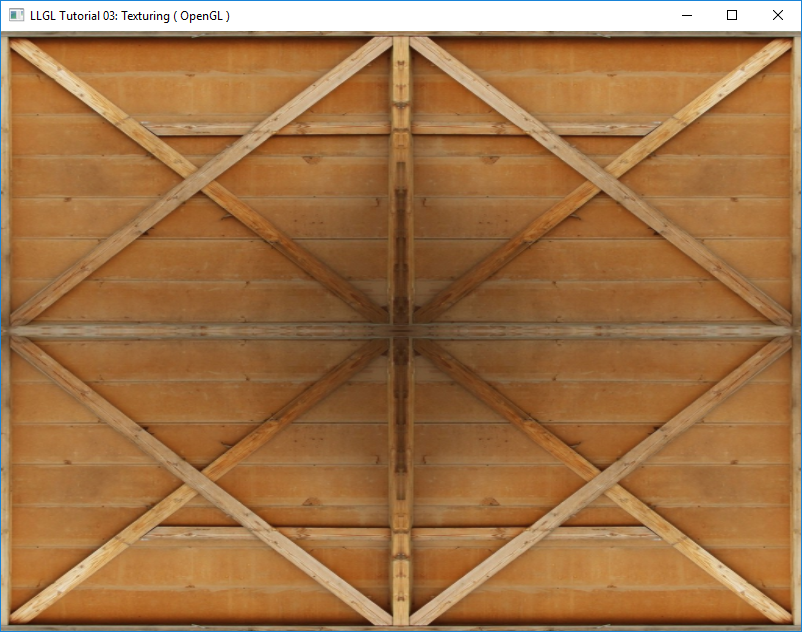
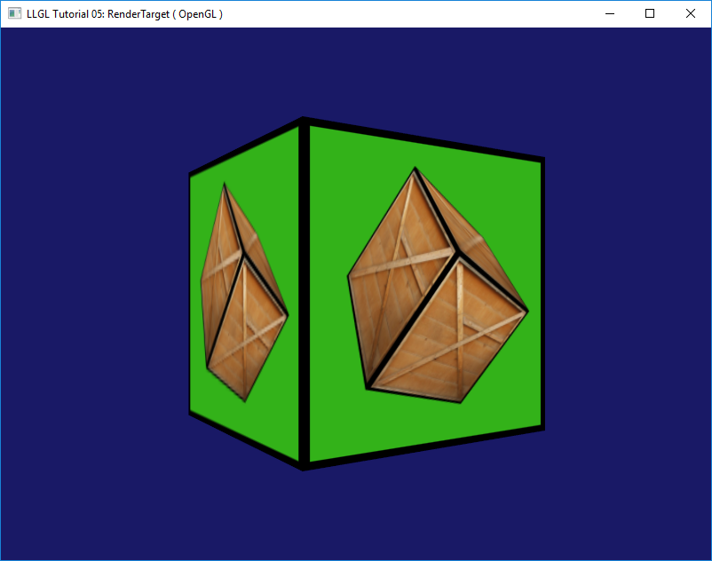
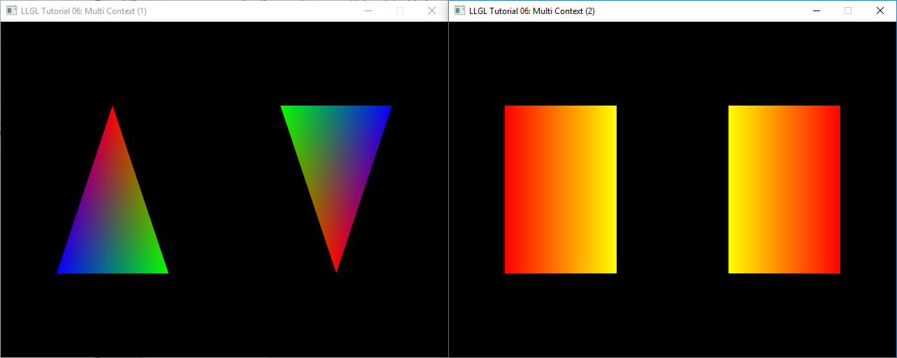
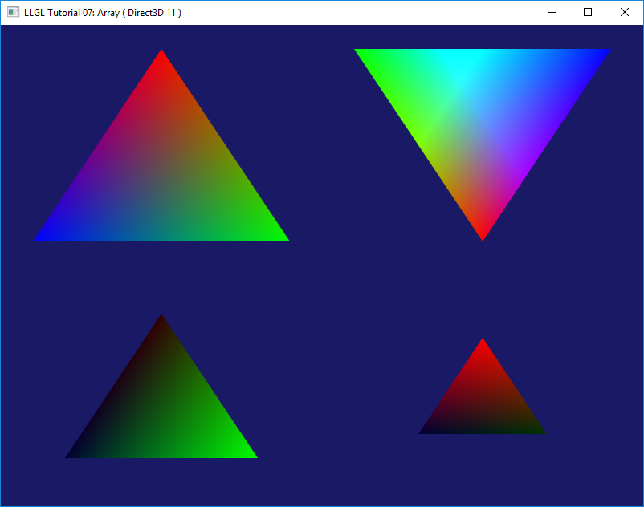
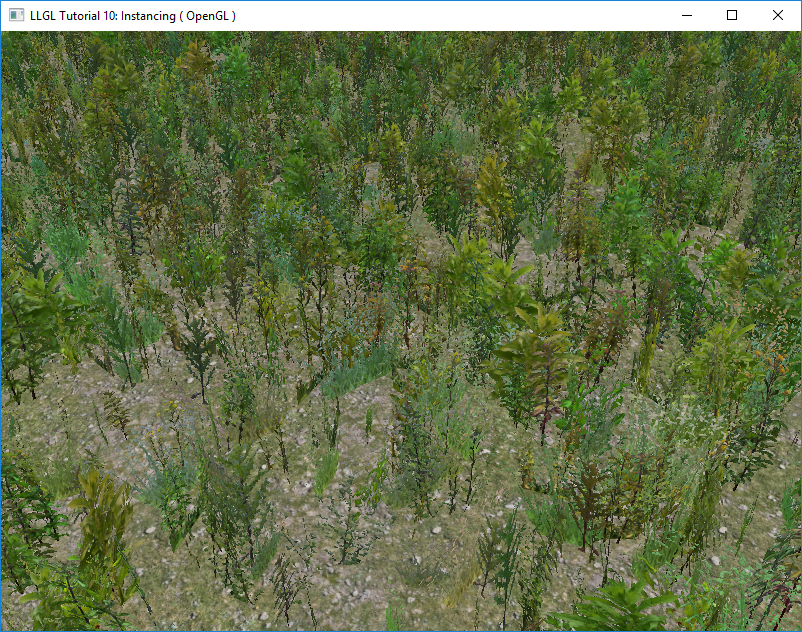

Low Level Graphics Library (LLGL)
=================================

<p align="center"></p>

License
-------

[3-Clause BSD License](https://github.com/LukasBanana/LLGL/blob/master/LICENSE.txt)


Documentation
-------------

- [Getting Started with LLGL](https://github.com/LukasBanana/LLGL/blob/master/docu/GettingStarted/Getting%20Started%20with%20LLGL.pdf) (PDF) with Introduction, Hello Triangle Tutorial, and Extensibility Example with GLFW
- [LLGL Reference Manual](https://github.com/LukasBanana/LLGL/blob/master/docu/refman.pdf) (PDF)
- [LLGL Coding Conventions](https://github.com/LukasBanana/LLGL/blob/master/docu/CodingConventions/Coding%20Conventions%20for%20LLGL.pdf) (PDF)


Progress
--------

- **Version**: 0.01 Beta

| Renderer | Progress | Remarks |
|----------|:--------:|---------|
| OpenGL | ~85% | |
| Direct3D 11 | ~85% | |
| Direct3D 12 | ~5% | Experimental state |
| Vulkan | 0% | Not started yet |

| Platform | Progress | Remarks |
|----------|:--------:|---------|
| Win32 | 100% | |
| Linux | 50% | Anti-aliasing is currently not supported |
| MacOS | 10% | Only a few tutorials are running (Tested on *macOS Sierra*) |


Thin Abstraction Layer
----------------------

```cpp
// Interface:
CommandBuffer::DrawIndexed(unsigned int numVertices, unsigned int firstIndex);

// OpenGL Implementation:
void GLCommandBuffer::DrawIndexed(unsigned int numVertices, unsigned int firstIndex)
{
	glDrawElements(
		renderState_.drawMode,
		static_cast<GLsizei>(numVertices),
		renderState_.indexBufferDataType,
		(reinterpret_cast<const GLvoid*>(firstIndex * renderState_.indexBufferStride))
	);
}

// Direct3D 11 Implementation
void D3D11CommandBuffer::DrawIndexed(unsigned int numVertices, unsigned int firstIndex)
{
	context_->DrawIndexed(numVertices, firstIndex, 0);
}

// Direct3D 12 Implementation
void D3D12CommandBuffer::DrawIndexed(unsigned int numVertices, unsigned int firstIndex)
{
	commandList_->DrawIndexedInstanced(numVertices, 1, firstIndex, 0, 0);
}

// Vulkan Implementation
void VKCommandBuffer::DrawIndexed(unsigned int numVertices, unsigned int firstIndex)
{
	vkCmdDrawIndexed(commandBuffer_, numVertices, 1, firstIndex, 0, 0);
}
```


Tutorials and Examples
----------------------

This repository contains several tutorials and examples which show how to use LLGL.
Here is a brief overview:

### [Tutorial 01: Hello Triangle](tutorial/Tutorial01_HelloTriangle/main.cpp)

Getting started tutorial where a single multi-colored triangle is rendered.

<p align="center"></p>

### [Tutorial 02: Tessellation](tutorial/Tutorial02_Tessellation/main.cpp)

Simple tessellation example without any textures.

<p align="center"></p>

### [Tutorial 03: Texturing](tutorial/Tutorial03_Texturing/main.cpp)

Simple texturing and sampler state example.

<p align="center"></p>

### [Tutorial 04: Query](tutorial/Tutorial04_Query/main.cpp)

Shows how to use Query objects and conditional rendering for occlusion culling.

*No screenshot available*

### [Tutorial 05: Render Target](tutorial/Tutorial05_RenderTarget/main.cpp)

Simple render target example with optional multi-sample texture (Texture2DMS/ sampler2DMS).

<p align="center"></p>

### [Tutorial 06: Multi Context](tutorial/Tutorial06_MultiContext/main.cpp)

Multi-context tutorial shows the following rendering techniques:
multiple render contexts (one window each), rendering simultaneously into multiple viewports, geometry shader.

<p align="center"></p>

### [Tutorial 07: Array](tutorial/Tutorial07_Array/main.cpp)

Shows how to use buffer arrays, i.e. render with multiple vertex buffers simultaneously, and hardware instancing.

<p align="center"></p>

### [Tutorial 08: Compute](tutorial/Tutorial08_Compute/main.cpp)

Small example with a compute shader and a storage buffer.

*No screenshot available*

### [Tutorial 09: StreamOutput](tutorial/Tutorial09_StreamOutput/main.cpp)

Small example with a geometry shader and a stream-output buffer.

*No screenshot available*

### [Tutorial 10: Instancing](tutorial/Tutorial10_Instancing/main.cpp)

Practical example of hardware instancing by rendering tens of thousands of different textured plants instances.

<p align="center"></p>


