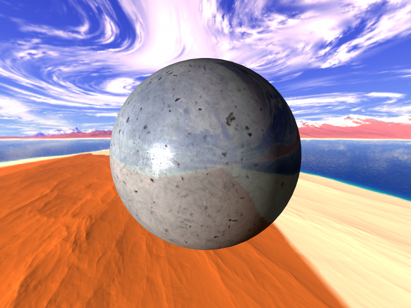

# Low Level Graphics Library (LLGL)

<p align="center">
    <a href="https://github.com/LukasBanana/LLGL/blob/master/LICENSE.txt"></a>
    <a href="https://discord.com/channels/1257440130021457941"></a?>
</p>

<p align="center"></p>


## Abstract

LLGL aims to be a thin abstraction layer for a wide variety of modern and legacy rendering APIs as well as a multitude of platforms targeting both desktop and mobile.
LLGL provides close coupling with the underlying APIs for a rich feature set while also simplifying architectural hurdles.
The library is written mostly in C++11 with the addition of a C99, C# 6.0, and Go wrapper.


## Documentation

- **Version**: 0.04 Beta (see [ChangeLog](docu/ChangeLog))
- [Getting Started with LLGL](docu/GettingStarted/Getting%20Started%20with%20LLGL.pdf) (PDF)
with Introduction, Hello Triangle Tutorial, and Extensibility Example with [GLFW](http://www.glfw.org/)
- [LLGL Reference Manual](docu/refman.pdf) (PDF)
- [LLGL Coding Conventions](docu/CodingConventions/Coding%20Conventions%20for%20LLGL.pdf) (PDF)
- [C++ Examples and Tutorials](examples/Cpp)
- [C99 Examples](examples/C99)
- [C# Examples](examples/CSharp)
- [Go Examples](examples/Go)
- [WebGL Examples](https://lukasbanana.github.io/LLGL/docu/WebPage)


## Platform Support

| Platform | CI | D3D12 | D3D11 | Vulkan | OpenGL | Metal |
|----------|:--:|:-----:|:-----:|:------:|:------:|:-----:|
|  Windows | <p>[](https://github.com/LukasBanana/LLGL/actions/workflows/ci_windows.yml)</p> <p>[](https://ci.appveyor.com/project/LukasBanana/llgl)</p> | :heavy_check_mark: | :heavy_check_mark: | :heavy_check_mark: | :heavy_check_mark: | N/A |
|  UWP | [](https://github.com/LukasBanana/LLGL/actions/workflows/ci_uwp.yml) | :heavy_check_mark: | :heavy_check_mark: | N/A | N/A | N/A |
|  GNU/Linux | [](https://github.com/LukasBanana/LLGL/actions/workflows/ci_linux.yml) | N/A | N/A | :heavy_check_mark: | :heavy_check_mark: | N/A |
|  macOS | [](https://github.com/LukasBanana/LLGL/actions/workflows/ci_macos.yml) | N/A | N/A | :heavy_check_mark: | :heavy_check_mark: | :heavy_check_mark: |
|  iOS | [](https://github.com/LukasBanana/LLGL/actions/workflows/ci_ios.yml) | N/A | N/A | :heavy_check_mark: | :heavy_check_mark: | :heavy_check_mark: |
|  Android | [](https://github.com/LukasBanana/LLGL/actions/workflows/ci_android.yml) | N/A | N/A | :construction: | :heavy_check_mark: | N/A |
|  Wasm | [](https://github.com/LukasBanana/LLGL/actions/workflows/ci_wasm.yml) | N/A | N/A | N/A | :heavy_check_mark: | N/A |
|  CMake/Unity | [](https://github.com/LukasBanana/LLGL/actions/workflows/ci_unity.yml) | | | | | |


## Build Notes

Build scripts are provided for [**CMake**]((https://cmake.org/)). See [LLGL Build System](https://github.com/LukasBanana/LLGL/tree/master/docu#llgl-build-system) for more details.

### Windows

[**Visual Studio 2015**](https://visualstudio.microsoft.com/) or later is required to build LLGL on Windows.
The Windows SDK is also required to build D3D11 and D3D12 backends.

### macOS, iOS

[**Xcode 9**](https://developer.apple.com/xcode/) or later is required to build LLGL on macOS and iOS.
For older Macs, there is a legacy mode to build LLGL for Mac OS X 10.6 using [MacPorts](https://www.macports.org/) of Clang.

### GNU/Linux

LLGL on GNU/Linux requires the development libraries for [X11](https://www.x.org/) and its [Xrandr](https://www.x.org/wiki/Projects/XRandR/) extension (see [docs](docu#gnulinux) for details).

### Android

[Android NDK](https://developer.android.com/ndk) with at least API level 21 is required.
The build script supports generating project files for [Android Studio](https://developer.android.com/studio).

## Installing (vcpkg)

Alternatively, you can build and install LLGL using [vcpkg](https://github.com/Microsoft/vcpkg/) dependency manager:

```
    git clone https://github.com/Microsoft/vcpkg.git
    cd vcpkg
    ./bootstrap-vcpkg.sh
    ./vcpkg integrate install
    ./vcpkg install llgl
```

The LLGL port in vcpkg is kept up to date by Microsoft team members and community contributors. If the version is out of date, please [create an issue or pull request](https://github.com/Microsoft/vcpkg) on the vcpkg repository.


## Showcase

<p align="center">
    
    
</p>

<p align="center">
    
    
</p>

<p align="center">
    
    
</p>

