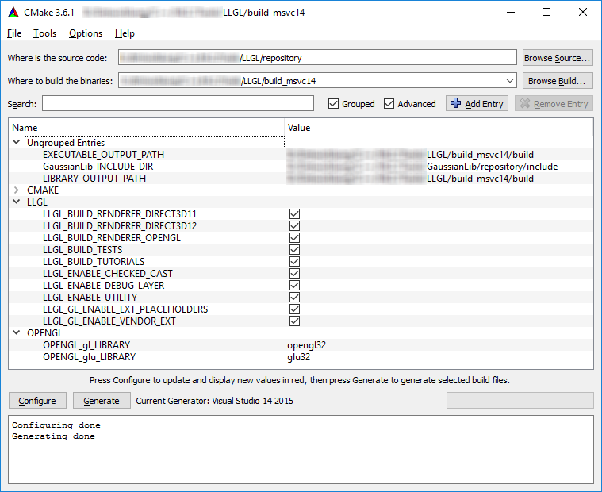

# Getting Started with LLGL

Last updated by L. Hermanns on 9/12/2026

<p align="center">
  
</p>


## Table of Contents

- [In a nutshell](#in-a-nutshell)
- [Prerequisites](#prerequisites)
- [Progress](#progress)
- [Build Process](#build-process)
- [API Overview](#api-overview)
- [Custom Surface Class](#custom-surface-class)
- [Custom Render System](#custom-render-system)


# Introduction

## In a nutshell

### What can LLGL do for me?

- **Unification**
    LLGL provides a unified interface across all supported renderers.
    Write your graphics render passes once and use them across multiple rendering APIs and platforms.

- **Low Overhead**
    LLGL is meant to be a thin abstraction layer which only adds as less overhead between your application and the underlying rendering API as possible.
    At best, a function is just a wrapper that forwards the parameters to the native rendering API.

- **Compatibility**
    LLGL provides various compatibility functionalities between the renderers.
    For example, some image formats that are supported by OpenGL but not by Direct3D are converted 'on the fly' by LLGL.
    However, some compromises are inevitable, due to different hardware restrictions.
    Having said that, all incompatibilities are well documented.

- **Simplification**
    Where close access to the hardware is not necessary, LLGL provides useful simplifications.
    For example, creating a swap-chain as well as a device context across multiple platforms can be a maintenance burden when done manually.
    With LLGL, this can be done with a few lines of code while maintaining a high degree of control thanks to rich descriptor structures.

- **Debug Layer**
    In debug mode, LLGL makes use of the native debug layers for the respective renderer.
    These debug layers, however, vary in quality depending on the API.
    LLGL offers another debug layer on top of them which performs extensive state-, parameter-, and descriptor validation for every command sent to the GPU.
    This can be a powerful tool to find invalid render states or erroneous descriptors.

- **Extension Support**
    OpenGL in particular is a complex system due to its many extensions. For texturing alone, LLGL manages over eight different extensions.
    Depending on which extension is available on the host platform, LLGL uses the most efficient or otherwise emulates the functionality.
    Even a few vendor specific extensions are supported.
    Extensions in form of API revisions in Direct3D are also supported such as mesh shaders and variable rate shading (VRS).

### What can LLGL *not* do for me?

- **Shader Cross Compilation**
    LLGL unifies the underlying rendering APIs as far as possible, but since each rendering API has its own shading language,
    all shaders need to be provided for each selected renderer explicitly.
    Having said that, there are several shader cross compilers available:
    - [DirectXShaderCompiler](https://github.com/Microsoft/DirectXShaderCompiler)
    - [SPIRV-Cross](https://github.com/KhronosGroup/SPIRV-Cross)
    - [glslang](https://github.com/khronosGroup/glslang)
    - [Slang](https://shader-slang.org/)
    
    Most recently, LLGL also provides a build script to translate shaders for all examples (see [TranslateShaders.py](../../scripts/TranslateShaders.py)).

- **Scene Management**
    LLGL is a low-level render system which does not provide any high-level scene management or animation system.
    It provides you with a set of functions to submit draw commands and render states to the graphics hardware as well as managing raw hardware buffers.
    'Game engine'-like functionality or anything beyond graphics is not part of LLGL.


## Prerequisites

LLGL is a thin abstraction layer for graphics APIs such as Direct3D, Vulkan, Metal, and OpenGL.
It is meant to abstract these rendering technologies to one uniform interface.
The library is written entirely in C++11, so you'll need a modern C++ compiler, i.e. at least **VisualC++ 2015** for Windows,
**g++ 4.8** for Linux, or **Clang 3.1** for MacOS.
To take advantage of this library you should be familiar with these subjects:
- **Basic C++11 Programming**
    Since the library is written in C++11, you should know something about *smart pointers*,
    *raw pointers*, and basic *object-oriented programming* (OOP) in C++.

- **Basic Linear Algebra**
    You should be familiar with at least *Vectors* and *Matrices*.
    They are the building blocks for geometry, topology, transformations, and projections from 3D space onto a 2D screen.

- **Fundamentals in Graphics Programming**
    You should be familiar with the fundamentals of graphics programming, since this is only a low-level graphics library.
    You should also be familiar with at least one of the major graphics APIs, i.e. *Direct3D*, *Vulkan*, *Metal*, or *OpenGL*,
    because LLGL does only little to no higher abstractions.

- **Shading Languages**
    LLGL necessitates to write your own shaders, so you should be familiar with [GLSL](https://www.khronos.org/opengl/wiki/OpenGL_Shading_Language), [HLSL](https://docs.microsoft.com/en-us/windows/desktop/direct3dhlsl/dx-graphics-hlsl), or [Metal](https://developer.apple.com/metal/Metal-Shading-Language-Specification.pdf), or any backend agnostic language such as [Slang](https://shader-slang.org/) for instance.


## Progress

As with many open-source projects that people work on in their spare time, this project does *not* claim to be complete nor that it ever will.
The best source to convince yourself of its capabilities is to take a look at the examples that are included in the LLGL repository.

### Platforms
- **Windows**
    Windows 11 is the main development environment of the original author, so this platform has the best support.

- **GNU/Linux**
    Ubuntu 17 (GNU/Linux) is used by the author to develop the Linux port. GNU/Linux is supported for the most part.
    Both OpenGL and the Vulkan backend are available.

- **macOS**
    The development environment for the MacOS port is *macOS Catalina* (as of 2026).
    The Metal backend is lacking behind in features but most examples are supported.

- **iOS**
    Experimental state for the iOS mobile platform.

- **Andriod**
    Experimental state but both GLES 3 and Vulkan are supported.

### Renderers
- **Direct3D 12** on Windows only
- **Direct3D 11** on Windows only
- **Vulkan** on Windows and GNU/Linux
- **Metal** on macOS and iOS
- **OpenGL** on Windows, GNU/Linux, and macOS
- **OpenGL ES 3** on Android and iOS
- **WebGL 2** on WebAssembly

The OpenGL backend supports various profiles. The major development happens for desktop OpenGL Core profile
but Compatibility profile is also supported to make it work with older versions of MacOS down to version 10.6 Snow Leopard
when compiled in legacy mode.

### Known issues
A major feature with quite a lot of known issues is multi-threaded command recording.
One of the big selling points of Vulkan and Direct3D 12 for better multi-threaded rendering support does not work correctly in LLGL as of 2026.
Ironically, this is currently only fully support in the OpenGL backend as it servers as the reference implementation of LLGL since it's supported on most platforms.


## Build Process

See also [LLGL Build System](../README.md).

### Cloning Repository

There are some submodules in the LLGL repository, all of which are optional.
These submodules are located in the `external/` directory.
To clone the repository with [git](https://git-scm.com/), enter the following line in a command prompt:

```sh
git clone https://github.com/LukasBanana/LLGL.git
```

To clone the repository with all its submodules, enter the following:

```sh
git clone --recursive https://github.com/LukasBanana/LLGL.git
```

### Dependencies

Since version 0.02, LLGL has no longer any required base dependencies except the one for the respective renderers.
Previously, the [GaussianLib](https://github.com/LukasBanana/GaussianLib) was required for linear algebra but has been replaced by a few plain-old-data structures.
The GaussianLib is now only required for the Examples and Test projects.

#### OpenGL

To build the OpenGL render system you need the OpenGL extension header files and an up-to-date graphics driver.
- For Windows the header files `glext.h` and `wglext.h` are required.
- For Linux the header files `glext.h` and `glxext.h` are required.
- For MacOS no header files need to be downloaded, since the OpenGL version depends on the OS version.

You can find the header files at the [OpenGL registry page](https://www.opengl.org/registry/#headers)
or in this repository under [external/OpenGL/](../../external/OpenGL).
Place the header files in the `include/GL/` folder of your compiler environment
or add the include path later in your build settings.

#### Direct3D

Since VisualStudio 2013, the DirectX framework (of which Direct3D is a part of) is included in the Windows SDK. Install at least 10.0.10240.0 or newer.

#### Vulkan

To build the Vulkan render system you need the [Vulkan SDK](https://lunarg.com/vulkan-sdk/),
and of course a graphics driver which supports at least Vulkan 1.0.

### Build Tool

To build the LLGL project files you need the build tool [CMake 3.7](https://cmake.org/) or later.
The build process is now demonstrated with the CMake GUI on Windows, but it can also be configured
on a command line (more about this see [cmake.org/runningcmake](https://cmake.org/runningcmake)).

Set the source directory ("Where is the source code:") to the LLGL repository
and set the build directory ("Where to build the binaries") where you want your project files.
In this example (see [Figure](#fig-cmake-mask1)) the source directory is `<...>/LLGL/repository`
and the build directory is `<...>/LLGL/build_msvc14` because the project files are configured for MSVC14 (VisualStudio 2015).

Now set the GaussianLib include directory if examples are enabled (in this case `<...>/GaussianLib/repository/include`)
and click on "Configure". Once the configuration ran successfully, you should see the message "Configuring done"
in the lower box. To finally create the project files, click on "Generate".
Then your project files should be located in the build directory you just set up previously.

<a id="fig-cmake-mask1"></a>



There are several options you can enable or disable to build the project:
- `LLGL_BUILD_(TESTS/EXAMPLES/RENDERER_...)`
    Specifies whether to include all test, all examples, or the respective renderer projects.

- `LLGL_D3D11_ENABLE_FEATURELEVEL`
    Specifies which feature level is enabled in the Direct3D 11 renderer.
    For example, feature level 11.1 requires that your development environment can find the `<d3d11_1.h>` header file.
    Feature level 11.1 enables logic fragment operations, and feature level 11.3 enables conservative rasterization for the D3D11 renderer.

- `LLGL_ENABLE_CHECKED_CAST`
    Specifies whether to enable or disable dynamic checked casts.
    This uses C++ `dynamic_cast` for all interface objects instead of `static_cast` and is only intended for debugging.

- `LLGL_ENABLE_DEBUG_LAYER`
    Specifies whether to enable or disable the debug layer.
    This is a wrapper around the render system and all other render objects for effective debugging.

- `LLGL_ENABLE_SPIRV_REFLECT`
    Specifies whether to include the submodule `external/SPIRV` to enable code reflection of SPIR-V shader modules for the Vulkan renderer.
    This is required for the unit tests and even though it is not required for the base library and its Vulkan backend, it is highly recommended
    to include this dependency. Otherwise, there are some restrictions on pipeline layouts besides the lack of shader reflection.

- `LLGL_GL_ENABLE_DSA_EXT`
    Specifies whether to enable or disable the `GL_ARB_direct_state_access` extension that spans the entire OpenGL render system.
    This can be used for fine-tuning as this extensions does not add new functionality but may or may not improve performance.

- `LLGL_GL_ENABLE_VENDOR_EXT`
    Specifies whether vendor specific OpenGL extensions should be enabled or disabled.
    One of these extensions is for conservative rasterization
    (`GL_NV_conservative_raster` and `GL_INTEL_conservative_rasterization`) for instance.
    These extensions will only be loaded and used by the runtime if they are available on the host platform.

- `LLGL_GL_INCLUDE_EXTERNAL`
    Specifies whether to include the OpenGL header files from the `external/GL/` directory of the LLGL repository.
    Otherwise the `GL/` directory must be elsewhere specified in your include search paths.


## API Overview

LLGL has a straightforward and unified API design.
For object creation, there is commonly a "`...Descriptor`" structure (e.g. `LLGL::BufferDescriptor` to describe a GPU buffer),
which contains all information to describe the GPU resource and its properties.

### Rendering Interfaces

There are three major interfaces for rendering:
- `RenderSystem` for object ownership (creation and deletion) and read/write operations between CPU and GPU.
- `SwapChain` to configure a framebuffer and its back buffers to render into.
- `CommandBuffer` to set render states, draw primitives, and dispatch compute commands.

#### RenderSystem

In the `RenderSystem` interface there are several functions of the following form:

```
// Create a new object
Create...

// Write data from CPU to GPU
Write...

// Read data back from GPU to CPU
Read...

// Map memory of an object from GPU to CPU memory space
Map...

// Finish memory mapping
Unmap...

// Release an object
Release
```

#### SwapChain

The most important function in the `SwapChain` interface is `Present` to show the content of the back buffer on the screen.
There are a few other functions to access the context window and change video mode:

```
// Access the surface to render into ('Window' on desktop/ 'Canvas' on mobile)
GetSurface

// Resizes all front- and back buffers (i.e. resolution, fullscreen/windowed mode etc.)
ResizeBuffers

// Set vertical synchronization (Vsync) interval
SetVsyncInterval
```

#### CommandBuffer

There are several overloaded functions for drawing operations with the naming convention
`Draw`, `DrawIndexed`, `DrawInstanced`, and `DrawIndexedInstanced`.
The most other functions are used to configure the command buffer of the graphics API, which have the following form:

```
// Set a hardware buffer/ texture/ sampler etc.
Set...

// Begin and always end a state (e.g. BeginQuery/ EndQuery)
Begin...
End...

// Draw primitives
Draw...
```

### Windowing System

LLGL has the `Window` interface for a very basic but platform independent windowing system.
Use its static function `Create` to create an instance of this interface for the host platform.
A custom implementation of this interface can also be written and used for any renderer.
[Custom Surface Class](#custom-surface-class) illustrates a custom implementation with [GLFW](http://www.glfw.org/).


# Extensibility

## Custom Surface Class

In this example, a simple custom implementation of the `Surface` interface is demonstrated,
to show how LLGL can be used with other windowing system libraries.
Here we will use the popular cross-platform library [GLFW](http://www.glfw.org/).

We start with the include files of GLFW and LLGL:

```
// Include GLFW library (in this example we use the Win32 platform)
#define GLFW_EXPOSE_NATIVE_WIN32
#include <GLFW/glfw3.h>
#include <GLFW/glfw3native.h>

// Include LLGL and also the native handle structures
#include <LLGL/LLGL.h>
#include <LLGL/Platform/NativeHandle.h>
```

Now we declare our custom surface class and override all necessary interface functions.
We could also inherit from the `Window` interface but this is not really meaningful here:

```cpp
class CustomSurface : public LLGL::Surface {
public:
    // Constructor and destructor
    CustomSurface(const LLGL::Extent2D& size, const char* title);
    ~CustomSurface();

    // Custom function to poll events from GLFW event queue.
    void PollEvents();

public:
    // Retrieve the native handle (e.g. `HWND` on Windows).
    void GetNativeHandle(void* nativeHandle, std::size_t nativeHandleSize) const override;

    // Return the content size (drawable area of the surface).
    LLGL::Extent2D GetContentSize() const override;

    // Change dimensions and properties when a swap-chain changes its buffer size and/or fullscreen mode.
    bool AdaptForVideoMode(LLGL::Extent2D* resolution, bool* fullscreen) override;

    // Return the display the surface resides in.
    LLGL::Display* FindResidentDisplay() const override;

private:
    GLFWwindow* CreateGLFWWindow();

    std::string    title_;
    LLGL::Extent2D size_;
    GLFWwindow*    wnd_ = nullptr; // GLFW window pointer
};
```

This is an example of a minimal interface implementation.
We start implementing the constructor, destructor, the `CreateGLFWWindow()` and `PollEvents()` functions:

```cpp
CustomSurface::CustomSurface(const LLGL::Extent2D& size, const char* title) :
    title_ { title              },
    size_  { size               },
    wnd_   { CreateGLFWWindow() }
{
}

CustomSurface::~CustomSurface() {
    // Destroy GLFW window
    glfwDestroyWindow(wnd_);
}

GLFWwindow* CustomSurface::CreateGLFWWindow() {
    // Create GLFW window with class members
    GLFWwindow* wnd = glfwCreateWindow(size_.width, size_.height, title_.c_str(), nullptr, nullptr);
    assert(wnd != nullptr && "failed to create GLFW window");
    return wnd;
}

bool CustomSurface::PollEvents() {
    // Poll events from GLFW windowing system
    glfwPollEvents();

    // Return true until the user pressed the close button
    return !glfwWindowShouldClose(wnd_);
}
```

Next we implement the `Surface` interface functions, beginning with `GetNativeHandle()`.
This is important, because any renderer needs access to the native window handle.
On MS/Windows, this is of type `HWND` from the Win32 API.
On GNU/Linux, we need to pass three parameters: `::Display*` from X11 (not to be confused with `LLGL::Display`),
`::Window` from X11 (not to be used with `LLGL::Window`), and `::XVisualInfo*` from GLX.
On MacOS, it is of type `NSResponder*` from the Cocoa API (base interface for `NSWindow` and `NSView`).
In this example we only implement it for Win32:

```cpp
void CustomSurface::GetNativeHandle(void* nativeHandle, std::size_t nativeHandleSize) const {
    // This function must always return a valid native handle!
    if (nativeHandleSize == sizeof(LLGL::NativeHandle)) {
        auto handle = reinterpret_cast<LLGL::NativeHandle*>(nativeHandle);
        handle->window = glfwGetWin32Window(wnd_);
    }
}
```

The remaining functions are straightforward:

```cpp
LLGL::Extent2D CustomSurface::GetContentSize() const {
    // Actually the client-area size of the window must be returned,
    // but for this example the entire window size is sufficient.
    return size_;
}

bool CustomSurface::AdaptForVideoMode(LLGL::Extent2D* resolution, bool* fullscreen) {
    // Resize GLFW window for the new video mode resolution.
    size_ = resolution;
    glfwSetWindowSize(wnd_, size_.width, size_.height);
    return true;
}

LLGL::Display* CustomSurface::FindResidentDisplay() const {
    // Just return primary display
    return LLGL::Display::GetPrimary();
}
```

Finally we are done with our custom window class :-) Now we can start using it with a swap-chain in our main entry point:

```cpp
int main() {
    // Initialize GLFW
    if (!glfwInit()) {
        return -1;
    }

    // Load render system
    auto myRenderer = LLGL::RenderSystem::Load("OpenGL");

    // Create an instance of our custom window class
    const LLGL::Extent2D resolution{ 1280, 768 };
    auto mySurface = std::make_shared<CustomSurface>(resolution, "LLGL test with GLFW");

    // Create render context and pass the custom window
    LLGL::SwapChainDescriptor mySwapChainDesc;
    mySwapChainDesc.resolution = resolution;
    LLGL::SwapChain* mySwapChain = myRenderer->CreateSwapChain(mySwapChainDesc, mySurface);

    // Scene construction ...

    while (mySurface->PollEvents()) {
        // Rendering ...
    }

    return 0;
}
```

That's all folks. The rest can be seen in the tutorials.

## Custom Render System

This is only a brief overivew on how to implement your own render system with LLGL.
The details will take some familiarization of the ecosystem.

Use the backend generator Python script [BackendGen](../../scripts/BackendGen) as starting point to generate the stubs of your backend.
This backends generates the common source files with empty function bodies and also generates a new CMakeLists.txt file.
You still have to manually include this new CMake file into the root [CMakeLists.txt](../../CMakeLists.txt) script.

The access point of a backend module from a shared library are implemented in *sources/Renderer/&lt;BACKEND&gt;/&lt;PREFIX&gt;ModuleInterface.cpp*
and they are implemented via the `LLGL_IMPLEMENT_RENDERER_MODULE()` macro. Those are a hand full of functions exported via `extern "C"`.

```cpp
#include "../ModuleInterface.h"
#include "CustomOpenGLRenderSystem.h"

LLGL_IMPLEMENT_RENDERER_MODULE(
    CustomOpenGLRenderer,           // Module name
    "My custom OpenGL Renderer",    // Renderer name
    LLGL::RendererID::Reserved + 1, // Renderer ID number start after LLGL::RendererID::Reserved
    LLGL::CustomOpenGLRenderer,     // Class of the custom renderer, implementing LLGL::RenderSystem
    0                               // Priority number for LLGL::RenderSystem::FindModule(), 0 being highest
);
```

That's all you have to do, except of implementing the entire `RenderSystem` interface in your `CustomOpenGLRenderSystem` class ;-).
After that, you can load your render system like this:

```cpp
// Load custom render system:
// If the shared library on Windows is LLGL_CustomOpenGLRenderer.dll,
// the function argument must be "CustomOpenGLRenderer".
LLGL::RenderSystemPtr myRenderer = LLGL::RenderSystem::Load("CustomOpenGLRenderer");

// Start using the custom renderer ...
```
