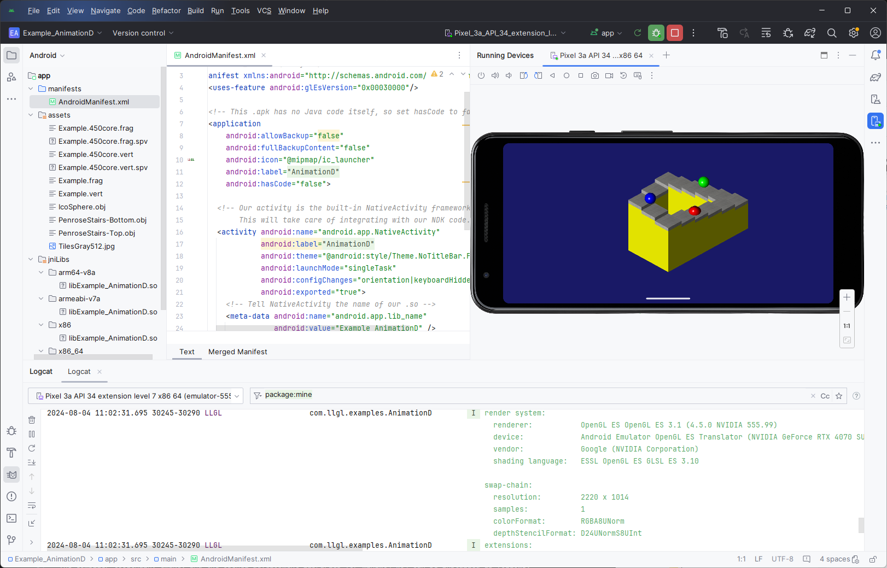
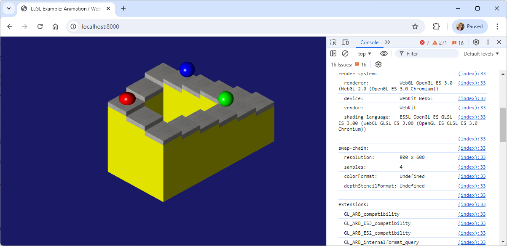

# LLGL Build System


## CMake

The primary build tool for LLGL is [CMake](https://cmake.org/) and while LLGL is compatible with older versions down to version 3.7,
it is recommended to use a more up to date version, i.e. 3.18 and later. You can either use the CMake GUI, run the cmake command manually,
or run the *Build* script for the respective platform (run them with `-h`/`--help` for more details). 


## Windows

LLGL is compatible with the MSVC toolchain of [Visual Studio](https://visualstudio.microsoft.com/) 2015 and later.
To build D3D11 and D3D12 backends, the Windows SDK 10 (10.0.10240.0 or later) is also required.


## macOS

LLGL for macOS is compatible with [Xcode](https://developer.apple.com/xcode/) 9 and later.

To build LLGL on older Macs back to Mac OS X 10.6 Snow Leopard with Xcode 3,
there is a legacy mode (run `$ ./BuildMacOS.command --legacy`) using [MacPorts](https://www.macports.org/) of Clang.
This mode only supports the OpenGL backend with compatibility profile for GL 2.0-2.1.


## iOS

It is recommended to use a higher version of [Xcode](https://developer.apple.com/xcode/) for LLGL on iOS.
At least version 12 on *macOS 10.15 Catalina* is required to test the Metal backend on the iOS simulator.


## Android

The build script for Android compiles LLGL for one or more ABIs, since Android is available on many different devices.
It can generate the folder structure of all example projects for [Android Studio](https://developer.android.com/studio).
The recommended process to build LLGL examples for Android can be split into two steps:
1. Run `./BuildAndroid.sh --apps` (additional arguments are optional), which compiles LLGL for the default ABIs (arm64-v8a, armeabi-v7a, x86, x86_64).
2. Open the respective example directory (*&lt;LLGL-ROOT&gt;/build_android/apps/&lt;EXAMPLE&gt;*) in Android Studio to build and run the app in either a simulator or on your Android device.
On Windows, MSYS2 can be used to run *BuildAndroid.sh*.

<p align="center">
    
</p>

#### Known issues

Currently only the GLES backend is supported for Android. Vulkan backend compiles but is not stable (synchronization issues are visible).


## GNU/Linux

The `BuildLinux.sh` script recognizes several major Linux distributions.
Use `$ ./BuildLinux.sh -h` in a command prompt for more details.
See also `scripts/ListMissingPackages.sh` for details about supported OS distributions.

The following libraries are the minimum requirement to build LLGL on Linux:
- **X11**: `libx11-dev` (Debian), `libx11` (Arch), `libx11-devel` (RedHat)
- **Xrandr**: `libxrandr-dev` (Debian), `libxrandr` (Arch), `libXrandr-devel` (RedHat)


## MSYS2

To build LLGL with the GNU ABI for Windows using MinGW, there is a build script for [MSYS2](https://www.msys2.org/).
The compiler toolchain, cmake, and the OpenGL development libraries for mingw64-w64 can be installed as follows:
```
$ pacman -S mingw-w64-x86_64-gcc
$ pacman -S mingw-w64-x86_64-cmake
$ pacman -S mingw-w64-x86_64-glew
$ pacman -S mingw-w64-x86_64-freeglut
```
The build script `BuildMsys2.sh` can be used to automate the build process.
Use `$ ./BuildMsys2.sh -h` in a command prompt for more details.


## WebAssembly (Wasm)

*- This is in an experimental state -*

LLGL can be built for the web using [Emscripten](https://emscripten.org/), [WebAssembly](https://webassembly.org/), and [WebGL 2](https://www.khronos.org/webgl/).
When building on Windows, it is recommended to use the [Windows Subsystem for Linux (WSL)](https://ubuntu.com/desktop/wsl) to run the *BuildWasm.sh* bash script.
The generated example projects can be tested by running a local web server from the output folder, for instance with [Node.js](https://nodejs.org/) or Python `http.server` module:
```
$ python -m http.server
```
Then launch your web browser of choice and open the URL http://localhost:8000/.

<p align="center">
    
</p>

#### Known issues

The **WebGL backend does not work correctly on Safari**. There is a workaround which detects Safari browsers to disable anti-aliasing which mitigates the issue on Intel based Macs.
On all ARM based Macs and iOS devices, Safari shows synchronization issues that mostly affect buffer updates via `glBufferSubData` making it look as if staging buffers
are not synchronized between CPU and GPU, even though WebGL does not have a concept of staging buffers like Vulkan or D3D.

