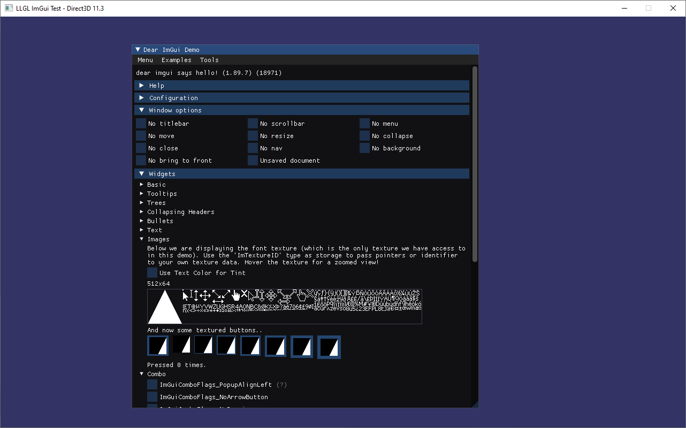

# Dear ImGui - Popular library for UI rendering and event handling

<p align="center"></p>

## Overview

"Dear ImGui", from now on simply "ImGui", is a popular C++ library to render UI elements and handle their user events with minimal dependencies and setup.
ImGui rendering directly, or "immediate" rather, into the current device context, which means it will interact directly with the underlying rendering API.
While this is against the philosophy of an ecapsulated abstraction layer, i.e. a library that hides all the low-level details,
LLGL does provide a few functions to access the API specific device objects for interoperability purposes.

## ImGui Setup

ImGui is intended to be integrated directly into the project, but building it as a static library is also possible.
For the sake of simplicity, we will simply download its source and put it into our project alongside our own source code.

First, download ImGui source code from GitHub (https://github.com/ocornut/imgui) and put it into your project solution.
We will need all main source files from the root of the ImGui directory as well as the backend sources for the respective rendering API we are interested in.
For this tutorial, we will be using Direct3D 11 and therefore need `imgui_impl_dx11.cpp`/`.h` and `imgui_impl_win32.cpp`/`.h` files.

## LLGL Initialization

We start with declaring all header files at the top of our main source file.
Besides the usual `LLGs platform and renderer specific headers
#include <LLGL/LLGL.h>
#include <LLGL/PlatforL/LLGL.h`, we'll also include the platform and renderer specific headers to access their native handles and pass them to ImGui:
```cpp
// Include LLGL and itm/NativeHandle.h>
#include <LLGL/Backend/Direct3D11/NativeHandle.h>

// Include ImGui and its platform and renderer specific headers
#include "imgui.h"
#include "imgui_impl_win32.h"
#include "imgui_impl_dx11.h"

// ImGui and LLGL support multiple platforms, but as of right now, this tutorial is only written for Microsoft Windows.
#ifndef _WIN32
#   error Platform not supported for this example
#endif
```

For this tutorial, we only render text via ImGui and thus won't need any textures or shaders for LLGL.
Therefore, we only declare a few global variables to store the render system, swap-chain, command buffer,
and input handler as well as two COM pointers for the Direct3D device and its context:
```cpp
LLGL::RenderSystemPtr renderer;         // Main interface to create LLGL objects
LLGL::SwapChain*      swapChain;        // Chain of back buffers to render into and present on the screen
LLGL::CommandBuffer*  cmdBuffer;        // Interface to submit draw and compute commands to the GPU
LLGL::Input           input;            // Utility class to simplify input event handling
ID3D11Device*         d3dDevice;        // Direct3D main interface for object creation (COM pointer)
ID3D11DeviceContext*  d3dDeviceContext; // Direct3D interface to submit draw and compute commands (COM pointer)
```

The following code loads the D3D11 render system for LLGL, creates a swap-chain with a default initialized surface (i.e. the Win32 window), and a command buffer with an immediate context:
```cpp
static void InitLLGL()
{
    // Load D3D11 render system
    renderer = LLGL::RenderSystem::Load("Direct3D11");

    // Create swap-chain and use its default initialized surface
    LLGL::SwapChainDescriptor swapChainDesc;
    swapChainDesc.resolution = { 1280, 768 };
    swapChain = renderer->CreateSwapChain(swapChainDesc);

    // Create a command buffer with an immediate context
    cmdBuffer = renderer->CreateCommandBuffer(LLGL::CommandBufferFlags::ImmediateSubmit);
}
```

And here follows the code to unload LLGL:
```cpp
static void ShutdownLLGL()
{
    // Release D3D handles
    if (d3dDevice != nullptr)
        d3dDevice->Release();
    if (d3dDeviceContext != nullptr)
        d3dDeviceContext->Release();

    // Remove the surface from the input handler and unload LLGL
    input.Drop(swapChain->GetSurface());
    LLGL::RenderSystem::Unload(std::move(renderer));
}
```


## ImGui Initialization

The initialization of ImGui follows the D3D11 example provided in its repository (see https://github.com/ocornut/imgui/tree/master/examples/example_win32_directx11):
```cpp
static void InitImGui()
{
    // Setup Dear ImGui context
    IMGUI_CHECKVERSION();
    ImGui::CreateContext();
    ImGuiIO& io = ImGui::GetIO();
    io.ConfigFlags |= ImGuiConfigFlags_NavEnableKeyboard;

    // Setup Dear ImGui style
    ImGui::StyleColorsDark();

    // Setup platform backend
    LLGL::Window& wnd = LLGL::CastTo<LLGL::Window>(swapChain->GetSurface());
    LLGL::NativeHandle nativeHandle;
    wnd.GetNativeHandle(&nativeHandle, sizeof(nativeHandle));

    ImGui_ImplWin32_Init(nativeHandle.window);

    // Setup renderer backend
    LLGL::Direct3D11::RenderSystemNativeHandle nativeDeviceHandle;
    renderer->GetNativeHandle(&nativeDeviceHandle, sizeof(nativeDeviceHandle));
    d3dDevice = nativeDeviceHandle.device;

    LLGL::Direct3D11::CommandBufferNativeHandle nativeContextHandle;
    cmdBuffer->GetNativeHandle(&nativeContextHandle, sizeof(nativeContextHandle));
    d3dDeviceContext = nativeContextHandle.deviceContext;

    ImGui_ImplDX11_Init(d3dDevice, d3dDeviceContext);
}
```

The teardown of ImGui is similar to that of LLGL; we shutdown the respective backends and destroy its context:
```cpp
static void ShutdownImGui()
{
    // Shutdown ImGui
    ImGui_ImplDX11_Shutdown();
    ImGui_ImplWin32_Shutdown();
    ImGui::DestroyContext();
}
```

## Main Loop

In our main function, we call the initializers for LLGL and ImGui, show the main window, and run the main loop to render the UI and handle input events:
```cpp
int main()
{
    InitLLGL();
    InitImGui();

    LLGL::Window& wnd = LLGL::CastTo<LLGL::Window>(swapChain->GetSurface());
    wnd.SetTitle("LLGL ImGui Example - " + std::string(renderer->GetRendererInfo().rendererName));
    wnd.Show();

    input.Listen(wnd);

    const float backgroundColor[4] = { 0.2f, 0.2f, 0.4f, 1.0f };

    ImGuiIO& io = ImGui::GetIO();

    while (LLGL::Surface::ProcessEvents() && !input.KeyPressed(LLGL::Key::Escape))
    {
        // Forward user input to ImGui
        if (input.KeyDown(LLGL::Key::LButton))
        {
            io.AddMouseSourceEvent(ImGuiMouseSource_Mouse);
            io.AddMouseButtonEvent(ImGuiMouseButton_Left, true);
        }
        if (input.KeyUp(LLGL::Key::LButton))
        {
            io.AddMouseSourceEvent(ImGuiMouseSource_Mouse);
            io.AddMouseButtonEvent(ImGuiMouseButton_Left, false);
        }

        // Start the Dear ImGui frame
        ImGui_ImplDX11_NewFrame();
        ImGui_ImplWin32_NewFrame();
        ImGui::NewFrame();

        // Show ImGui's demo window
        ImGui::ShowDemoWindow();

        // Rendering
        cmdBuffer->Begin();
        {
            cmdBuffer->BeginRenderPass(*swapChain);
            {
                cmdBuffer->Clear(LLGL::ClearFlags::Color, LLGL::ClearValue{ backgroundColor });

                // GUI Rendering
                ImGui::Render();
                ImGui_ImplDX11_RenderDrawData(ImGui::GetDrawData());
            }
            cmdBuffer->EndRenderPass();
        }
        cmdBuffer->End();

        // Present result on screen
        swapChain->Present();

        // Reset input state
        input.Reset();
    }

    ShutdownImGui();
    ShutdownLLGL();

    return 0;
}
```

You only have to link your project against **LLGL.dll** and also make sure that **LLGL_Direct3D11.dll** (or **LLGLD.dll** and **LLGL_Direct3D11D.dll** respectively for the debug version) is located in the same directory as your executable.
Then the final result should look as shown above.

That's all folks!

