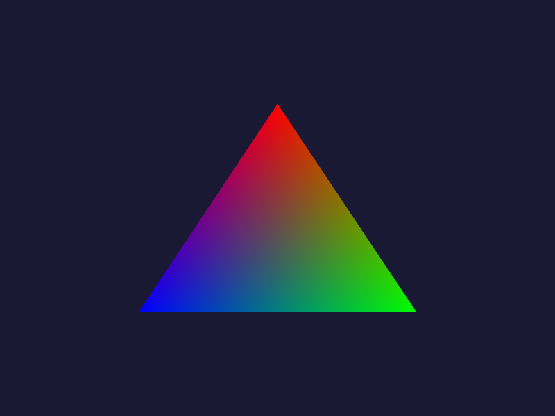
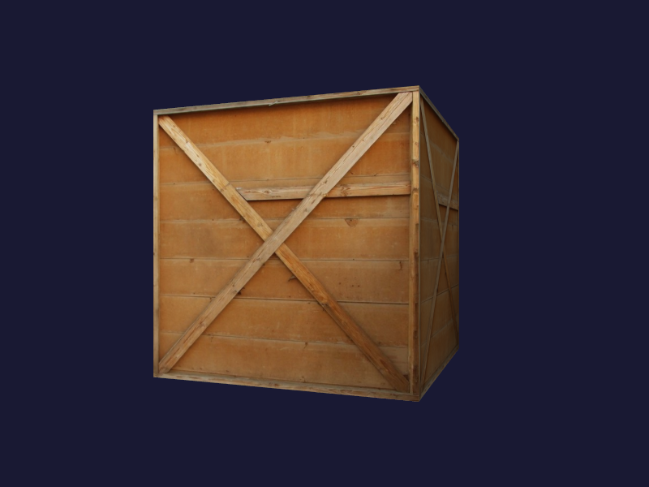

# C99 Examples

This folder contains all LLGL examples written in the C programming language (ISO-C99).
Note that you need to set the **working directory** to `<Your-LLGL-Repository>/examples/C99/<Example>` in order to get your examples running.
For the first example, this could be `/Users/JohnDoe/LLGL/examples/C99/HelloTriangle` or `C:\Users\JohnDoe\LLGL\examples\C99\HelloTriangle` for instance.

## Examples

### [Hello Triangle](HelloTriangle)

This example illustrates how to interact with LLGL in the C programing language.

### [Texturing](Texturing)

Texturing example with loading an image from file (using STB lib), indexed-drawing, and dynamic resources.

### [Offscreen](Offscreen)

Offscreen example renders into a texture and outputs the result onto disk instead of the screen.

