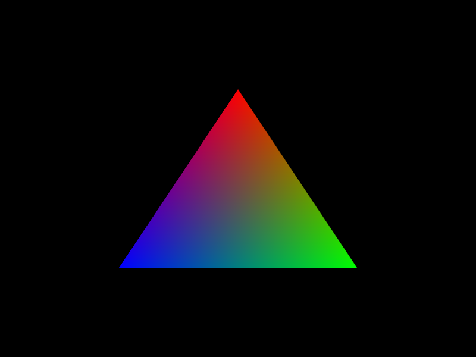

# Hello Triangle

<p align="center"></p>

## Initialization

The first thing we need for LLGL is an instance of the `RenderSystem` interface. This instance takes care of objects used for rendering:
```cpp
LLGL::RenderSystemPtr myRenderer = LLGL::RenderSystem::Load("Vulkan");
```
This is one of the few functions that takes a string rather than an enumeration to select something. This is because LLGL loads a render system dynamically at runtime from a module (i.e. a shared library, **.dll** on Windows, **.so** on GNU/Linux, and **.dylib** on macOS). On the one hand, we only need to link our project against **LLGL.lib** and on the other hand we can handle failures dynamically without bothering the user with error messages like "vulkan-1.dll could not be loaded".

The routine to find a suitable render system can look like this:
```cpp
LLGL::RenderSystemPtr myRenderer;
for (const char* moduleName : { "Direct3D12", "Direct3D11", "Vulkan", "OpenGL" }) {
    LLGL::Report report;
    myRenderer = LLGL::RenderSystem::Load(moduleName, &report);
    if (myRenderer != nullptr) {
        LLGL::Log::Printf("Renderer found: %s", report.GetText());
        break;
    }
}
if (myRenderer == nullptr) {
    /* Error: no suitable renderer found ... */
}
```
After we have a valid render system, we can continue with a swap-chain to draw something into. The swap-chain acts as a chain of two or three (by default two) framebuffers that are swapped out when the rendered result is presented to the screen. The active framebuffer we're drawing into is called a "back buffer" and the currently visible framebuffer on the screen is called the "front buffer". We can connect a swap-chain to a custom window (if we were using [GLFW](https://www.glfw.org/), [SDL](https://www.libsdl.org/), [wxWidgets](https://wxwidgets.org/), or [Qt](https://www.qt.io/) for instance), but if we omit the second parameter of the following function call, LLGL will create a default surface. `Surface` is the base for the `Window` interface on desktop platforms and `Canvas` interface on mobile platforms. These serve as a convenient windowing system for quick prototyping but only provide a minimal set of functionality to interact with the OS, e.g. resizing windows but no advanced features such as menus, popups, or anything that integrates deeply with the OS. For this example we only use the default surface:
```cpp
LLGL::SwapChainDescriptor mySwapChainDesc;
mySwapChainDesc.resolution  = { 800, 600 }; // Framebuffer resolution of 800x600 pixels
mySwapChainDesc.fullscreen  = false;        // No fullscreen, use windowed mode
mySwapChainDesc.samples     = 8;            // 8 samples for anti-aliasing
LLGL::SwapChain* mySwapChain = myRenderer->CreateSwapChain(mySwapChainDesc);
```
Most objects in LLGL are created with descriptors (similar to Direct3D and Vulkan). This one describes a swap-chain with a resolution of 800 x 600 pixels, windowed-mode (no fullscreen), and 8 samples for anti-aliasing. Note that multi-sampled anti-aliasing is no longer the standard for high fidelity gaming, but still proves useful to improve the image quality with little to no effort for programmers. Any other anti-aliasing technique will have to be implemented by yourself :-)


## Vertex Buffer

Next we create our vertex data for our triangle we want to render and then declare the vertex format which will be passed to the vertex buffer and vertex shader:
```cpp
struct MyVertex {
    float   position[2]; // 2D vector for X and Y coordinates
    uint8_t color[4];    // 4D vector for red, green, blue, and alpha components
};
```
For this tutorial we only want to render a single triangle so we define our 3 vertices:
```cpp
MyVertex myVertices[3] = {
    MyVertex{ {  0.0f,  0.5f }, { 255,   0,   0, 255 } }, // Red
    MyVertex{ {  0.5f, -0.5f }, {   0, 255,   0, 255 } }, // Green
    MyVertex{ { -0.5f, -0.5f }, {   0,   0, 255, 255 } }, // Blue
};
```
The `VertexFormat` structure has a couple of member functions to simplify the description of a vertex format, but we could also use the member variables directly. The `AppendAttribute` function determines the data offset for each vertex attribute automatically:
```cpp
LLGL::VertexFormat myVertexFormat;
myVertexFormat.AppendAttribute({ "position", LLGL::Format::RG32Float  });
myVertexFormat.AppendAttribute({ "color",    LLGL::Format::RGBA8UNorm });
```
Since `VertexFormat` is a utility structure that is optional in LLGL, we have to include it explicitly via `#include <LLGL/Misc/VertexFormat.h>`. The alternative is to declare an array of `LLGL::VertexAttribute` entries that explicitly specify the attribute's register location, byte offset, and stride (i.e. byte offset between vertices) of each member:
```cpp
LLGL::VertexAttribute myVertexFormatAttributes[2] = {
    LLGL::VertexAttribute{ "position", LLGL::Format::RG32Float,  0, offsetof(MyVertex, position), sizeof(MyVertex) },
    LLGL::VertexAttribute{ "color",    LLGL::Format::RGBA8UNorm, 1, offsetof(MyVertex, color   ), sizeof(MyVertex) },
};
```

The strings "position" and "color" must match the identifiers used in the shader, not the one we used in our `MyVertex` structure! We use an RGBA format for the color components even though the alpha channel is not used, because RGB formats are only supported by OpenGL and Vulkan. The identifier `UNorm` denotes an 'unsigned integer normalized' format, i.e. the unsigned byte values in the range [0, 255] will be normalized to the range [0, 1].

Now we can create the GPU vertex buffer:
```cpp
LLGL::BufferDescriptor myVBufferDesc;
myVBufferDesc.size          = sizeof(myVertices);            // Size (in bytes) of the buffer
myVBufferDesc.bindFlags     = LLGL::BindFlags::VertexBuffer; // Use for vertex buffer binding
myVBufferDesc.vertexAttribs = myVertexFormat.attributes;     // Vertex buffer attributes
LLGL::Buffer* myVertexBuffer = myRenderer->CreateBuffer(myVBufferDesc, myVertices);
```
The parameter `bindFlags` takes a bitwise OR combination of the enumeration entries of `LLG::BindFlags`, to tell the render system for which purposes the buffer will be used. In this case, we will only bind it as a vertex buffer.


## Shaders

Shaders are the programs that run on the GPU to "shade" pixels. At least that's where their historic significance comes from, as shaders have since found far more diverse applications. For this tutorial we only need a vertex and fragment (aka pixel) shader. To determine which shading language is supported by the current renderer, we can use the `shadingLanguages` container as shown here:
```cpp
bool IsSupported(LLGL::ShadingLanguage lang) {
    const auto& supportedLangs = myRenderer->GetRenderingCaps().shadingLanguages;
    return (std::find(supportedLangs.begin(), supportedLangs.end(), lang) != supportedLangs.end());
}
```
Here is an example of loading a shader for either HLSL or GLSL source files:
```cpp
LLGL::ShaderDescriptor myVSDesc, myFSDesc;
if (IsSupported(LLGL::ShadingLanguage::HLSL)) {
    myVSDesc = { LLGL::ShaderType::Vertex,   "MyShader.hlsl", "VMain", "vs_4_0" };
    myFSDesc = { LLGL::ShaderType::Fragment, "MyShader.hlsl", "PMain", "ps_4_0" };
} else if (IsSupported(LLGL::ShadingLanguage::GLSL)) {
    myVSDesc = { LLGL::ShaderType::Vertex,   "MyShader.vert" };
    myFSDesc = { LLGL::ShaderType::Fragment, "MyShader.frag" };
} else {
    /* Error: shading language not supported ... */
}
myVSDesc.vertex.inputAttribs = myVertexFormat.attributes;

LLGL::Shader* myVertexShader   = myRenderer->CreateShader(myVSDesc);
LLGL::Shader* myFragmentShader = myRenderer->CreateShader(myFSDesc);
```
`ShaderDescriptor` provides members to specifiy the shader code as content or as filename which is then loaded by the framework. In our case, we just load the shaders from file (e.g. `MyShader.hlsl`). The descriptor also provides a member to specify whether our shader is in binary or text form. However, not all render systems provide both. For example, Vulkan can only load binary SPIR-V modules. With Direct3D 11 and Direct3D 12, we can load either our HLSL shader directly from a text file or load a pre-compiled DXBC (D3D11/D3D12) and DXIL (D3D12 only) binary file. While it sure is convenient not having to pre-compile the shaders and just load them from source, this is only support for some renderers as long as they natively support it. This is to keep the dependencies in LLGL as minimal as possible. You'll most likely only need to compile from source during development as a finished product usually loads its assets, including shaders, in its most efficient form in binary. For this reason, it is recommended to set up a compilation pipeline that cross-compiles your shaders into the respective target format as needed (not if you only iterate on Direct3D backends for instance). Here is an example how to load a shader as content instead of loading it from file:
```cpp
LLGL::ShaderDescriptor myShaderDesc;
myShaderDesc.type                = LLGL::ShaderType::Vertex;
myShaderDesc.source              = "#version 330\n"
                                   "void main() {\n"
                                   "    gl_Position = vec4(0, 0, 0, 1);\n"
                                   "}\n";
myShaderDesc.sourceSize          = 0;                                  // Ignored for NUL-terminated sources
myShaderDesc.sourceType          = LLGL::ShaderSourceType::CodeString; // Source is provided as string in high-level language
myShaderDesc.entryPoint          = "";                                 // Only required for HLSL/Metal (can be null)
myShaderDesc.profile             = "";                                 // Only required for HLSL/Metal (can be null)
myShaderDesc.vertex.inputAttribs = myVertexFormat.attributes;          // Vertex input attribnutes (vertex shaders only)
LLGL::Shader* myExampleShader = myRenderer->CreateShader(myShaderDesc);
```
The members `entryPoint` and `profile` are only required for HLSL (e.g. `entryPoint="main"` and `profile="vs_4_0"`) and Metal (e.g. `entryPoint="main"` and `profile="1.1"`). The member `source` is of type `const char*` and is either a NUL-terminated string or a raw byte buffer (for shader byte code). If the source type is either `CodeFile` or `BinaryFile`, the source code is read from file.

Even if a shader compiles successfully, we can query the information log if the shader compiler reports some warnings:
```cpp
for (LLGL::Shader* shader : { myVertexShader, myFragmentShader }) {
    if (const LLGL::Report* report = shader->GetReport()) {
        if (report->HasErrors()) {
            LLGL::Log::Errorf("Shader compile errors:\n%s", report->GetText());
        } else {
            LLGL::Log::Printf("Shader compile warnings:\n%s", report->GetText());
        }
    }
}
```


## Graphics Pipeline & Command Buffer

Before we enter our render loop we need a pipeline state object (PSO) and a command buffer to submit draw commands to the GPU. For this tutorial we can use almost all default values in the graphics pipeline descriptor, but we always need to set the shaders:
```cpp
LLGL::GraphicsPipelineDescriptor myPipelineDesc;
myPipelineDesc.vertexShader                  = myVertexShader;
myPipelineDesc.fragmentShader                = myFragmentShader;
myPipelineDesc.rasterizer.multiSampleEnabled = (mySwapChainDesc.samples > 1);
LLGL::PipelineState* myPipeline = myRenderer->CreatePipelineState(myPipelineDesc);
```
Note that a graphics pipeline always needs at least a vertex shader. All other shader stages are optional. A graphics PSO with only a vertex shader can be used for shadow-mapping techniques, in which case the pipeline can only render depth values to the depth-stencil buffer but no color values.

The members `depth`, `stencil`, `rasterizer`, and `blend` from the  `GraphicsPipelineDescriptor` structure can be used to specify a lot more configurations for a graphics pipeline. But for now, we leave them as-is.

The command buffer is used to submit draw and compute commands to the command queue. For this tutorial, we only create an immediate command buffer, so we don't have to submit the commands explicitly to the command queue. Using `CommandBufferFlags::ImmediateSubmit` tells LLGL to submit the command buffer immediately after we are done recording our commands:
```cpp
LLGL::CommandBuffer* myCmdBuffer = myRenderer->CreateCommandBuffer(LLGL::CommandBufferFlags::ImmediateSubmit);
```


## Render Loop

Our render loop can be implemented with a simple `while`-statement in which we update the window events. The base interface `Surface` is sufficient for this task. Having said that, if we want to do a little bit more like changing the window title, adding event listeners, or even just showing the window (since it's initially hidden), we need an instance of the `Window` interface, which was created when we called `CreateSwapChain`:
```cpp
// Cast "Window" from base class "Surface" (only on desktop platforms such as Windows, GNU/Linux, and macOS)
LLGL::Window& myWindow = LLGL::CastTo<LLGL::Window>(mySwapChain->GetSurface());

// Set window title (aka. caption) and show window
myWindow.SetTitle("Hello Triangle");

// Process window events (such as user input) and exit loop once the main window has quit
while (LLGL::Surface::ProcessEvents() && !myWindow.HasQuit()) {
    /* Render code goes here ... */
}
```
The `ProcessEvents` function returns false when processing events is no longer possible but the main purpose of its return value is to put it into the loop condition so that it can be called before anything else for the next frame.

Next up is the render code inside the loop body. We start encoding graphics commands for our command buffer:
```cpp
myCmdBuffer->Begin();
```
Now we can bind resources that are independent of a render pass, such as the vertex buffer:
```cpp
myCmdBuffer->SetVertexBuffer(*myVertexBuffer);
```
Before we can start encoding drawing commands and other operations that are dependent on render passes, we need to start such a render pass:
```cpp
myCmdBuffer->BeginRenderPass(*mySwapChain);
```
We currently only use the default render pass that is created by the swap-chain automatically. These describe the color and depth-stencil formats for the output merger at the end of a graphics pipeline and whether they are being loaded or cleared at the beginning of the pipeline. The `BeginRenderPass` function not only starts a render pass but also specifies which render targets are being rendered into. In this case `mySwapChain` to render directly into the window content.

After binding the render target, we specify into which area the scene is rendered. For this simple example, we render into the entire swap-chain:
```cpp
myCmdBuffer->SetViewport(mySwapChain->GetResolution());
```
Contrary to Direct3D 12, LLGL manages the scissor rectangle automatically if the scissor test is disabled in the graphics pipeline (which is the default). Hence, we only need to set the viewport, but not the scissor rectangle.

As mentioned above, a render pass specifies whether to load or clear color and depth-stencil targets. The default render pass loads the content of all targets, so clearing them right after we start a render pass is inefficient but to keep this example small, we make use of a custom clear operation to start our new frame with a clear slate:
```cpp
myCmdBuffer->Clear(LLGL::ClearFlags::Color);
```
To clear multiple attachments of the active render target (and `SwapChain` is also a `RenderTarget` in LLGL) with different color and depth-stencil values, the `ClearAttachments` function can be used instead. The last state we set before rendering is the pipeline state we created earlier:
```cpp
myCmdBuffer->SetPipelineState(*myPipeline);
```
Now we can finally draw our first triangle:
```cpp
myCmdBuffer->Draw(3, 0);
```
This call generates three vertices and starts with the vertex ID zero. This is analogous to the drawing commands of all modern rendering APIs (i.e. Direct3D 12, Vulkan, Metal) as well as the legacy rendering APIs (i.e. Direct3D 11, OpenGL). The same holds true for the other `DrawInstanced`, `DrawIndexed`, and `DrawIndexedInstanced` functions. The nomenclature for these functions is derived from Direct3D.

Before we can present the result, we need to end the render pass as well as encoding the command buffer:
```cpp
myCmdBuffer->EndRenderPass();
myCmdBuffer->End();
```
Lastly, we have to present the result on the screen. As mentioned in the beginning of this tutorial, this function swaps out the front buffer with the active back buffer to present our scene.
```cpp
mySwapChain->Present();
```


That's all folks :-)


