# Tutorials and Examples

This repository contains several tutorials and examples which show how to use LLGL. Note that you need to set the **working directory** to `<Your-LLGL-Repository>/examples/Cpp/<Example>` in order to get your examples running. For the first example, this could be `/Users/JohnDoe/LLGL/examples/Cpp/HelloTriangle` or `C:\Users\JohnDoe\LLGL\examples\Cpp\HelloTriangle` for instance.

## Tutorials

### [Hello Triangle](HelloTriangle)

Getting started tutorial where a single multi-colored triangle is rendered.

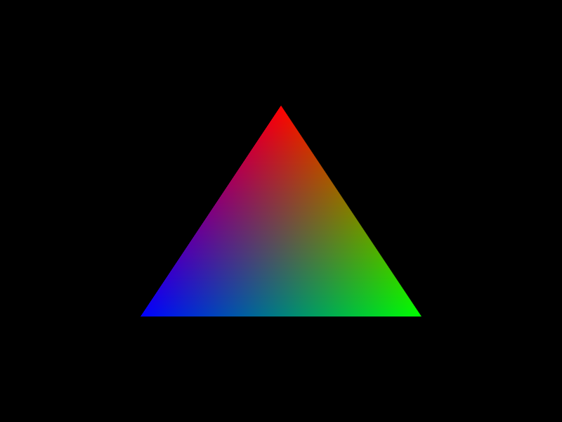

### [Tessellation](Tessellation)

Simple tessellation tutorial (without texturing).

## Examples

### [Texturing](Texturing)

Simple texturing and sampler state example.

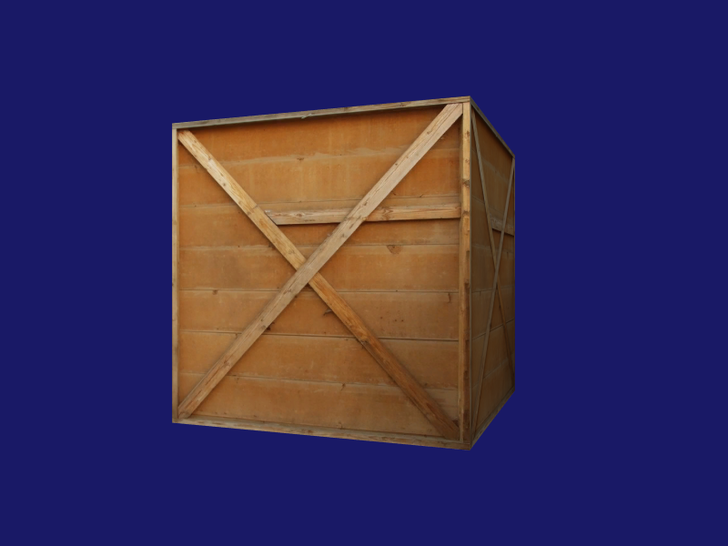

### [Queries](Queries)

Shows how to use Query objects and conditional rendering for occlusion culling.

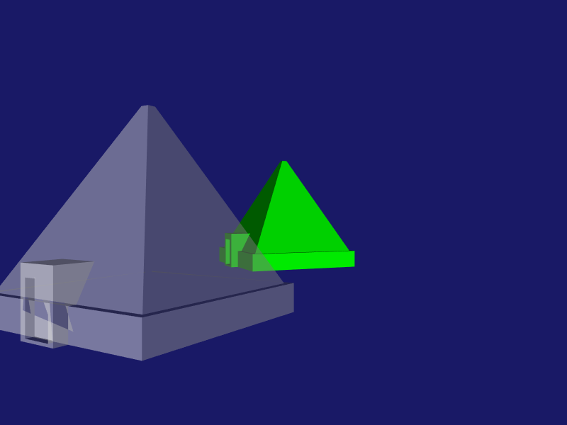

### [Render Target](RenderTarget)

Simple render target example with optional multi-sample texture (Texture2DMS/ sampler2DMS).

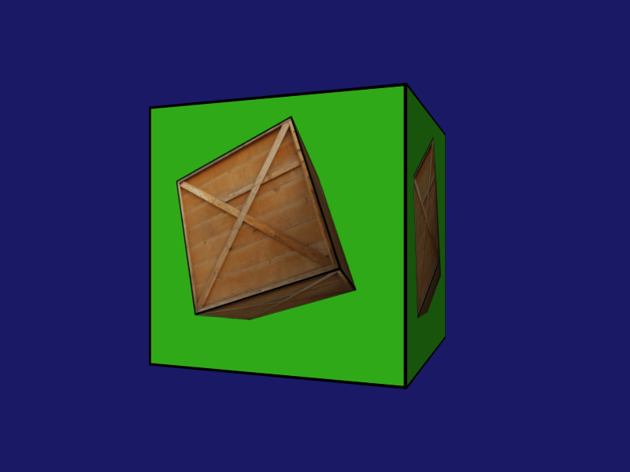

### [Multi Context](MultiContext)

Shows the following rendering techniques: multiple render contexts (one window each), rendering simultaneously into multiple viewports, geometry shader.

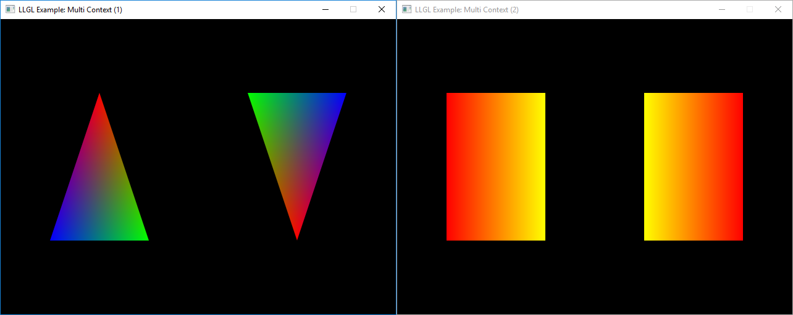

### [Buffer Array](BufferArray)

Shows how to use buffer arrays, i.e. render with multiple vertex buffers simultaneously, and hardware instancing.

### [Compute Shader](ComputeShader)

Small example with a compute shader and a storage buffer.

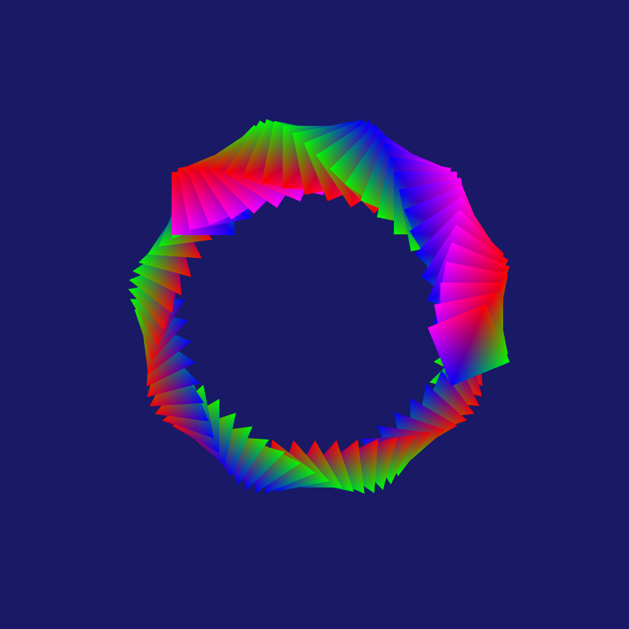

### [Stream-Output](StreamOutput)

Small example with a geometry shader and a stream-output buffer.

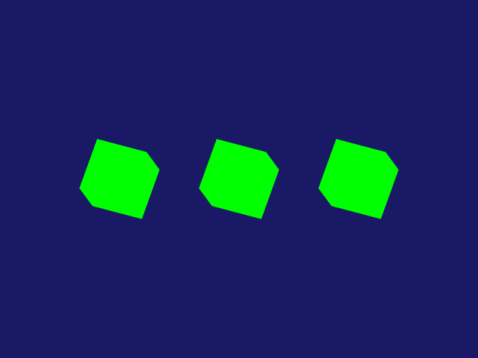

### [Instancing](Instancing)

Practical example of hardware instancing by rendering tens of thousands of different textured plants instances.

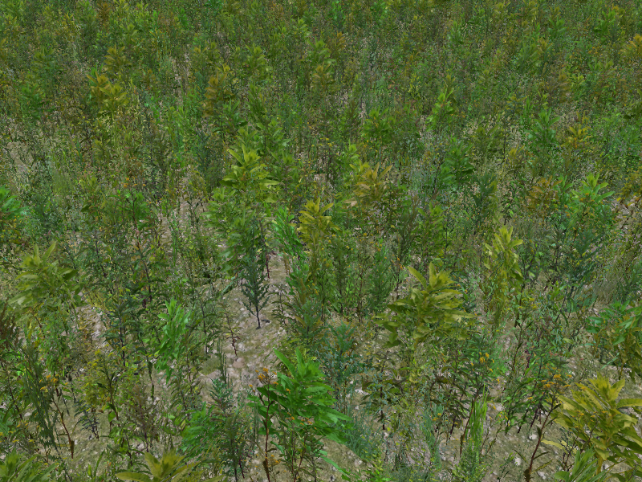

### [Post-Processing](PostProcessing)

Practical example of a glow effect with post-processing and the usage of several shaders, render targets and graphics pipelines.

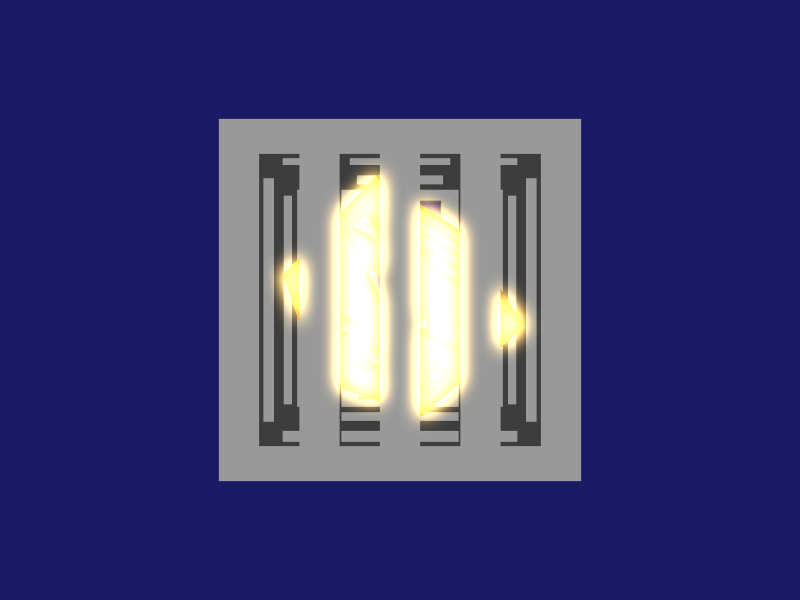

### [Multi Renderer](MultiRenderer)

Experimental example of using multiple renderers at once (only supported on Win32 platform).

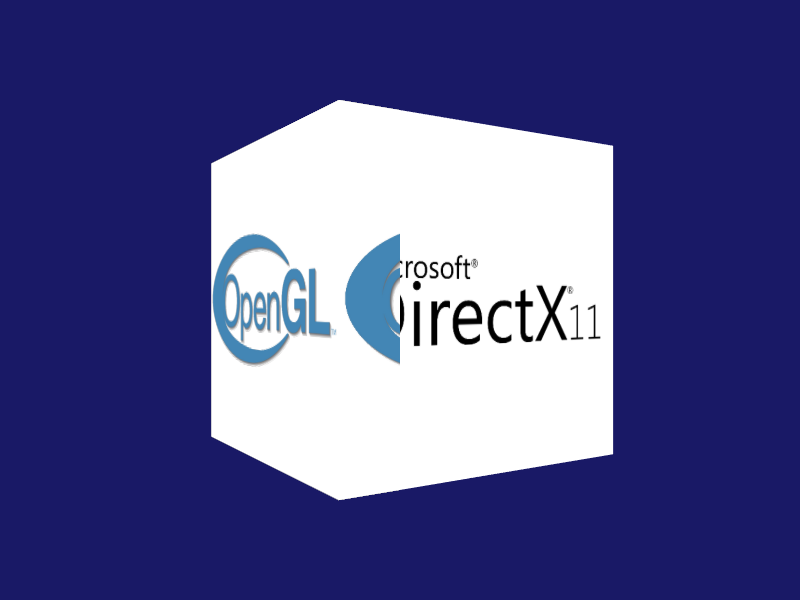

### [Shadow Mapping](ShadowMapping)

Practical example of standard shadow-mapping technique.

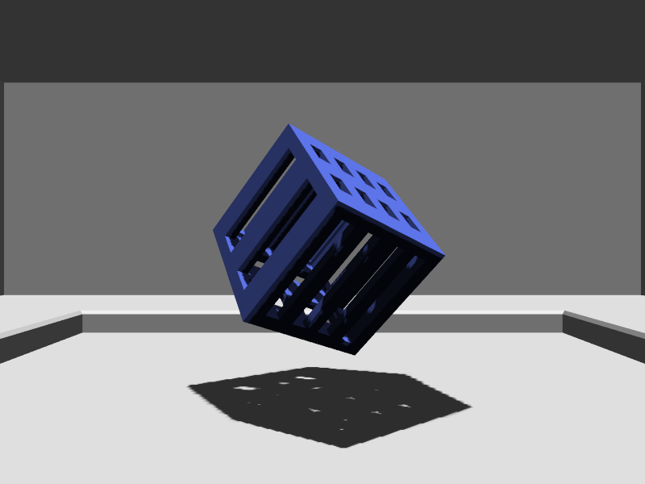

### [Stencil Buffer](StencilBuffer)

Rendering a portal using the stencil buffer.

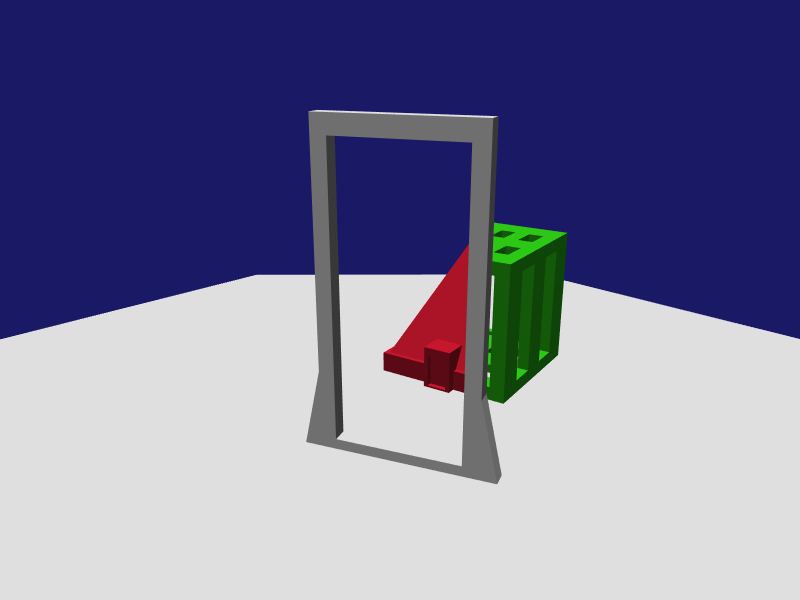

### [Animation](Animation)

Small animation example with orthogonal projection.

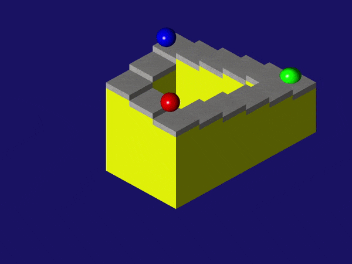

### [Volume Rendering](VolumeRendering)

Example of generating perlin noise into 3D texture with a glitter effect and volume rendering.

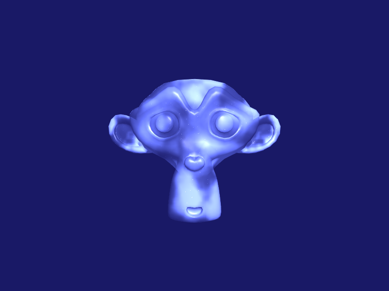

### [Cloth Physics](ClothPhysics)

Practical example of multiple compute shaders for position based dynamics.

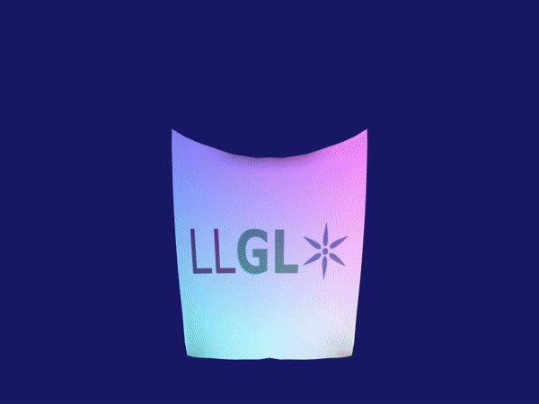

