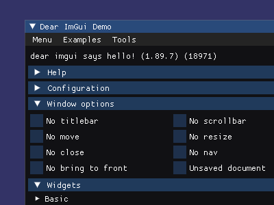
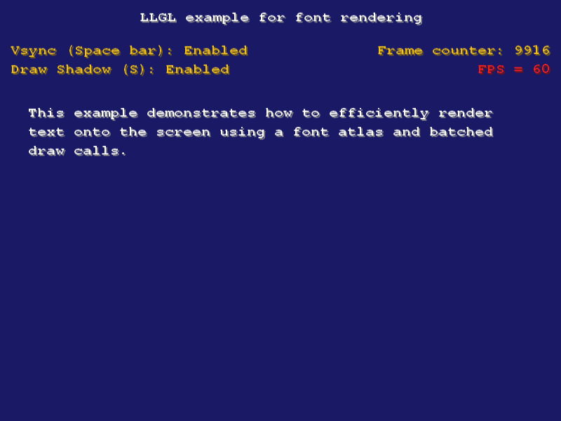
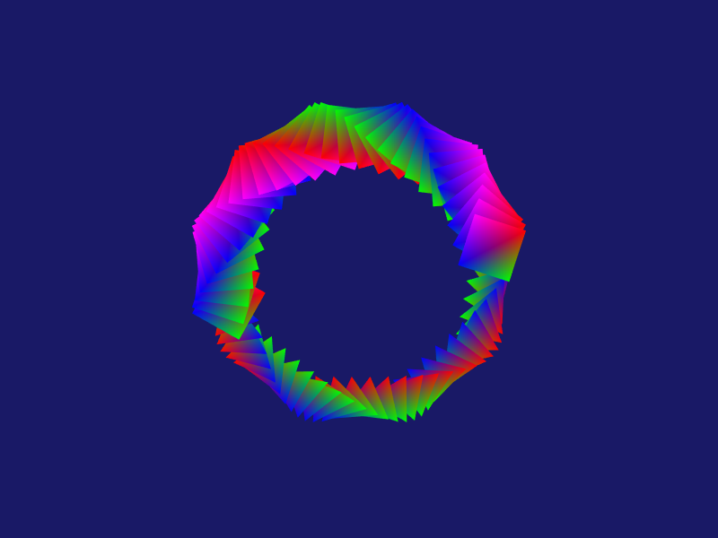
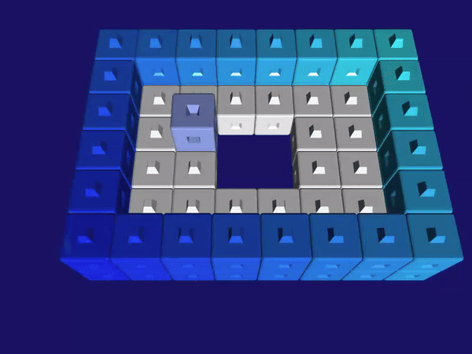

# Tutorials and Examples

This repository contains several tutorials and examples which show how to use LLGL. Note that you need to set the **working directory** to `<Your-LLGL-Repository>/examples/Cpp/<Example>` in order to get your examples running. For the first example, this could be `/Users/JohnDoe/LLGL/examples/Cpp/HelloTriangle` or `C:\Users\JohnDoe\LLGL\examples\Cpp\HelloTriangle` for instance.

## Tutorials

### [Hello Triangle](HelloTriangle)

Getting started tutorial where a single multi-colored triangle is rendered.

### [Tessellation](Tessellation)

Hardware tessellation for rendering highly detailed geometry.

### [ImGui](../../docu/Tutorials/ImGui)

Tutorial how to integrate ImGui into an LLGL project for UI rendering and event handling.

## Examples

### [Texturing](Texturing)
##### Try it with [WebGL](https://lukasbanana.github.io/LLGL/docu/WebPage/Example_Texturing/index.html)

Simple texturing and sampler state example.

### [Fonts](Fonts)
##### Try it with [WebGL](https://lukasbanana.github.io/LLGL/docu/WebPage/Example_Fonts/index.html)

Example how to render fonts efficiently in batched draw calls.

### [Queries](Queries)

Shows how to use Query objects and conditional rendering for occlusion culling.

### [Render Target](RenderTarget)
##### Try it with [WebGL](https://lukasbanana.github.io/LLGL/docu/WebPage/Example_RenderTarget/index.html)

Simple render target example with optional multi-sample texture (Texture2DMS/ sampler2DMS).

### [Multi Context](MultiContext)

Shows the following rendering techniques: multiple render contexts (one window each), rendering simultaneously into multiple viewports, geometry shader.

### [Indirect Draw](IndirectDraw)

Small example with a compute shader and a storage buffer for the indirect draw command.

### [Instancing](Instancing)

Practical example of hardware instancing by rendering tens of thousands of different textured plants instances.

### [Post-Processing](PostProcessing)
##### Try it with [WebGL](https://lukasbanana.github.io/LLGL/docu/WebPage/Example_PostProcessing/index.html)

Practical example of a glow effect with post-processing and the usage of several shaders, render targets and graphics pipelines.

### [Multi Renderer](MultiRenderer)

Experimental example of using multiple renderers at once (only supported on Win32 platform).

### [Shadow Mapping](ShadowMapping)
##### Try it with [WebGL](https://lukasbanana.github.io/LLGL/docu/WebPage/Example_ShadowMapping/index.html)

Practical example of standard shadow-mapping technique.

### [Stencil Buffer](StencilBuffer)
##### Try it with [WebGL](https://lukasbanana.github.io/LLGL/docu/WebPage/Example_StencilBuffer/index.html)

Rendering a portal using the stencil buffer.

### [Animation](Animation)
##### Try it with [WebGL](https://lukasbanana.github.io/LLGL/docu/WebPage/Example_Animation/index.html)

Small animation example with orthogonal projection.

### [Volume Rendering](VolumeRendering)

Example of generating perlin noise into 3D texture with a glitter effect and volume rendering.

### [Cloth Physics](ClothPhysics)

Practical example of multiple compute shaders for position based dynamics.

### [HelloGame](HelloGame)
##### Try it with [WebGL](https://lukasbanana.github.io/LLGL/docu/WebPage/Example_HelloGame/index.html)

Example of a small puzzle game. Easy to add new levels via text files.

