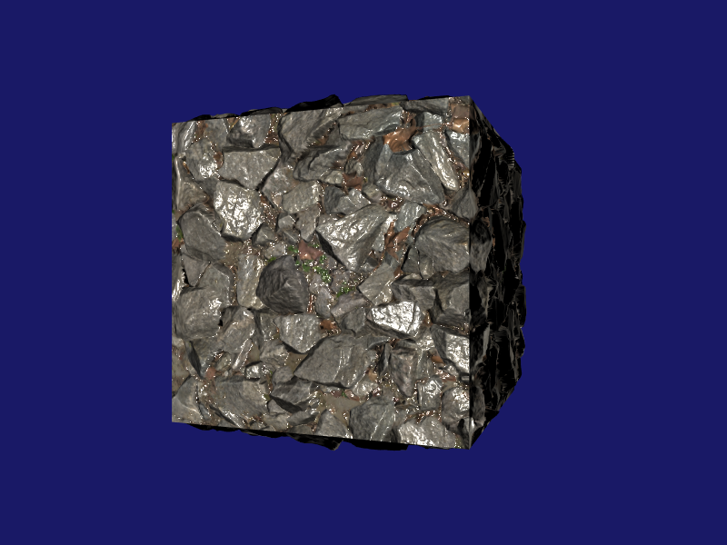

# Tessellation

<p align="center"></p>

## Prerequisites

This tutorial requires that you have already read the [Hello Triangle](../HelloTriangle) tutorial.


## Shader Resources

In legacy rendering APIs, such as OpenGL, shader resources were bound individually like with `glBindTexture`. Recent extensions allowed to bind multiple textures or uniform buffers at once. With modern rendering APIs there is only the option to bind one or more heaps of resources. This is either called "descriptor heap" (Direct3D 12) or "descriptor set" (Vulkan). In LLGL, this is managed by the `ResourceHeap` interface. But before we can create such a resource heap, we need a pipeline layout that specifies at which binding points the resources in the heap will be bound to a graphics or compute pipeline. This is done with the `PipelineLayout` interface and created as follows:
```cpp
LLGL::PipelineLayoutDescriptor myLayoutDesc;
myLayoutDesc.bindings = {
    LLGL::BindingDescriptor {
        "MyConstantBuffer",
        LLGL::ResourceType::Buffer,
        LLGL::BindFlags::ConstantBuffer,
        (IsMetal()
            ? LLGL::StageFlags::ComputeStage | LLGL::StageFlags::VertexStage
            : LLGL::StageFlags::AllTessStages),
        myConstantBufferBindingPoint
    }
};
LLGL::PipelineLayout* myPipelineLayout = myRenderer->CreatePipelineLayout(myLayoutDesc);
```
We need to specify different shader stages for the Metal backend. Although Metal supports tessellation there are no dedicated tessellation shader stages. They are laid out into a compute kernel and a so called post-tessellation vertex shader instead. For the tessellation tutorial, we only need a constant buffer that is bound to the tessellation control and tessellation evaluation shader stages. The descriptor field `bindings` is an STL container which we can easily initialize with a brace initializer list. The parameter `myConstantBufferBindingPoint` is just an unsigned integer that specifies the binding point. If its value is 3 for instance, the corresponding constant buffer in an HLSL shader could look like this:
```hlsl
cbuffer MyConstantBuffer : register(b3)
```
If you add more elements to the `bindings` container, make sure the order match with the resources we speciy next:
```cpp
LLGL::ResourceHeapDescriptor myResourceHeapDesc;
myResourceHeapDesc.pipelineLayout = myPipelineLayout;
myResourceHeapDesc.resourceViews  = { myConstantBuffer };
LLGL::ResourceHeap* myResourceHeap = myRenderer->CreateResourceHeap(myResourceHeapDesc);
```
The resource heap needs a reference to the pipeline layout we created. The resources (previously created with `CreateBuffer`, `CreateTexture`, or `CreateSampler`) are specified in the brace initializer list of the `resourceViews` container. The elements from this container are of the type `LLGL::ResourceViewDescriptor` but can be implicitly constructed with a pointer to a resource object. Speaking of which, all resources inherit from the `Resource` interface and these interfaces are: `Buffer`, `Texture`, and `Sampler`.


## Graphics Pipeline

Once we use resource heaps, we also need to specify our pipeline layout for the graphics pipeline where the resources are needed:
```cpp
LLGL::GraphicsPipelineDescriptor myPipelineDesc;
myPipelineDesc.shaderProgram       = myShaderProgram;                   // Vertex, tess-control, tess-evaluation, and fragment shaders
myPipelineDesc.pipelineLayout      = myPipelineLayout;                  // Specify our pipeline layout
myPipelineDesc.primitiveTopology   = LLGL::PrimitiveTopology::Patches4; // Input topology: patches with 4 control points
myPipelineDesc.depth.testEnabled   = true;                              // Enable depth test
myPipelineDesc.depth.writeEnabled  = true;                              // Enable depth writing
myPipelineDesc.rasterizer.cullMode = LLGL::CullMode::Back;              // Enable back-face culling
myPipelineDesc.rasterizer.frontCCW = true;                              // Front facing polygons: counter-clock-wise (CCW) winding
```
While most rendering APIs provide the tessellation parameters on the shader side, in Metal we need to specify some on the host application side.
The following parameters are ignored by all other backends:
```cpp
// We'll use 32-bit indices
pipelineDesc.tessellation.indexFormat       = LLGL::Format::R32UInt;

// Equivalent to [partitioning("fractional_odd")] in HLSL
pipelineDesc.tessellation.partition         = LLGL::TessellationPartition::FractionalOdd;

// Equivalent to [outputtopology("triangle_ccw")] in HLSL
pipelineDesc.tessellation.outputWindingCCW  = true;
```
Now we create the graphics pipeline state object (PSO):
```cpp
LLGL::PipelineState* myPipeline = myRenderer->CreatePipelineState(myPipelineDesc);
```
There are several parameters besides the pipeline layout that are needed for the tessellation tutorial. This time we use the depth buffer to render a 3D scene and not just a flat triangle. We also enable back-face culling as a minor optimization to omit triangles that are never visible anyways. But make sure to only use this when you render meshes that are entirely closed. When tessellation shaders are used in the graphics pipeline, the primitive toplogy must be one of the `LLGL::PrimitiveTopology::Patches1`-`32` enumeration entries. The number specifies the control point count. The maximum number of control points that are supported by the host platform can be determined as shown here:
```cpp
myRenderer->GetRenderingCaps().limits.maxPatchVertices
```


## Rendering

Since we use a depth buffer, we need to clear it just like the color buffer:
```cpp
myCmdBuffer->Clear(LLGL::ClearFlags::ColorDepth);
```
The flag `ColorDepth` is just a shortcut for `LLGL::ClearFlags::Color | LLGL::ClearFlags::Depth`.

Together with the vertex buffer, we also use an index buffer for this tutorial to utilize each vertex for multiple polygons. The index buffer creation works analogous to the vertex buffer and can be bound with the `SetIndexBuffer` function:
```cpp
myCmdBuffer->SetVertexBuffer(*myVertexBuffer);
myCmdBuffer->SetIndexBuffer(*myIndexBuffer);
```

Next, we bind the resource heap to the graphics pipeline (there is an analogous function for the compute pipeline):
```cpp
myCmdBuffer->SetResourceHeap(*myResourceHeap);
```
Last thing to mention which is different to the previous tutorial: we use the `DrawIndexed` function instead of `Draw`. Otherwise, the index buffer would be pointless for the draw command. If we want to render a tessellated cube, we need 6 patches each of which has 4 control points (since we used `Patches4` as topology). This means we have to generate 24 indices (24=6*4):
```cpp
myCmdBuffer->DrawIndexed(24, 0);
```


That's all folks :-)


