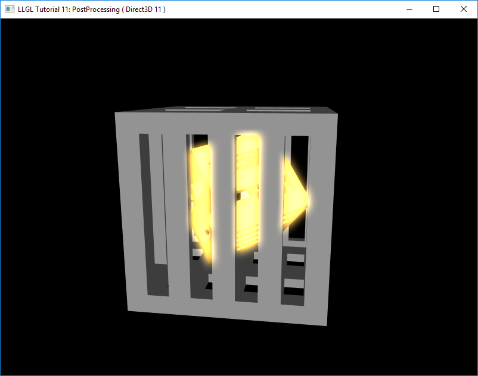
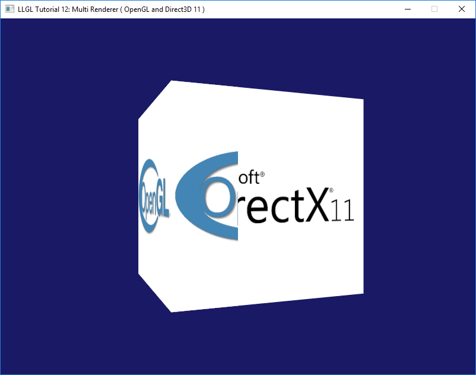

Tutorials and Examples
======================

This repository contains several tutorials and examples which show how to use LLGL.
Here is a brief overview:

### [Tutorial 01: Hello Triangle](Tutorial01_HelloTriangle)

Getting started tutorial where a single multi-colored triangle is rendered.

### [Tutorial 02: Tessellation](Tutorial02_Tessellation/main.cpp)

Simple tessellation example without any textures.

### [Tutorial 03: Texturing](Tutorial03_Texturing/main.cpp)

Simple texturing and sampler state example.

### [Tutorial 04: Query](Tutorial04_Query/main.cpp)

Shows how to use Query objects and conditional rendering for occlusion culling.

*No screenshot available*

### [Tutorial 05: Render Target](Tutorial05_RenderTarget/main.cpp)

Simple render target example with optional multi-sample texture (Texture2DMS/ sampler2DMS).

### [Tutorial 06: Multi Context](Tutorial06_MultiContext/main.cpp)

Multi-context tutorial shows the following rendering techniques:
multiple render contexts (one window each), rendering simultaneously into multiple viewports, geometry shader.

### [Tutorial 07: Array](Tutorial07_Array/main.cpp)

Shows how to use buffer arrays, i.e. render with multiple vertex buffers simultaneously, and hardware instancing.

### [Tutorial 08: Compute](Tutorial08_Compute/main.cpp)

Small example with a compute shader and a storage buffer.

*No screenshot available*

### [Tutorial 09: StreamOutput](Tutorial09_StreamOutput/main.cpp)

Small example with a geometry shader and a stream-output buffer.

*No screenshot available*

### [Tutorial 10: Instancing](Tutorial10_Instancing/main.cpp)

Practical example of hardware instancing by rendering tens of thousands of different textured plants instances.

### [Tutorial 11: PostProcessing](Tutorial11_PostProcessing/main.cpp)

Practical example of a glow effect with post-processing and the usage of several shaders, render targets and graphics pipelines.

### [Tutorial 12: MultiRenderer](Tutorial12_MultiRenderer/main.cpp)

Experimental example of using multiple renderers at once (only supported on Win32 platform).

