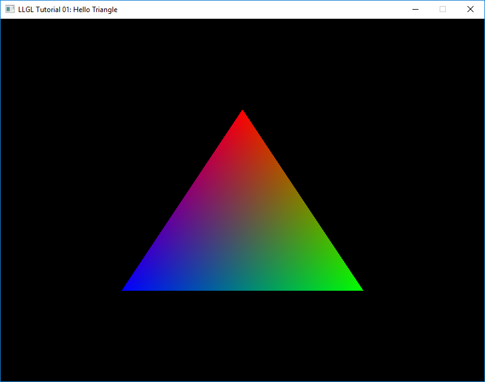

Hello Triangle
==============

<p align="center"></p>

Initialization:
---------------

The first thing we need to use LLGL is an instance of the `RenderSystem` interface. This instannce will take care of all objects used for rendering:
```cpp
std::unique_ptr<LLGL::RenderSystem> myRenderer = LLGL::RenderSystem::Load("Vulkan");
```
This is one of the few functions that takes a string rather than an enumeration to select something. This is because LLGL loads a render system dynamically at runtime from a module (i.e. a shared library, **.dll** on Windows, **.so** on GNU/Linux, and **.dylib** on macOS). On the one hand, we only need to link our project against **LLGL.lib**, and on the other hand we can catch an exception if our desired Vulkan renderer is not supported on the target platform. In this case we can load another renderer (e.g. "OpenGL") rather than disturbing the user with an error message such as "vulkan-1.dll could not be loaded".

The exception handling to find a suitable render system can look like this:
```cpp
std::unique_ptr<LLGL::RenderSystem> myRenderer;
for (auto module : { "Vulkan", "Direct3D12", "Direct3D11", "OpenGL" }) {
    try {
        myRenderer = LLGL::RenderSystem::Load(module);
        break;
    } catch (const std::exception& e) {
        /* Log exception or ignore ... */
    }
}
if (myRenderer == nullptr) {
    /* Error: no suitable renderer found ... */
}
```
After we have a valid render system, we can continue with a render context to draw something into. We can connect a render context to a custom window (if we were using GLFW, wxWidgets, or Qt for instance), but if we omit the second parameter of the following call, LLGL will create a default surface. `Surface` is the base for the `Window` interface on desktop platforms and `Canvas` interface on mobile platforms. For this example we only use the default surface:
```cpp
LLGL::RenderContextDescriptor myContextDesc;
myContextDesc.videoMode.resolution = { 800, 600 };
myContextDesc.videoMode.fullscreen = false;
myContextDesc.vsync.enabled        = true;
myContextDesc.multiSampling        = LLGL::MultiSamplingDescriptor { 8 };
LLGL::RenderContext* myContext = myRenderer->CreateRenderContext(contextDesc);
```
Most objects in LLGL are created with descriptors (similar to Direct3D and Vulkan). This one describes that we want a render context with a resolution of 800 x 600 pixels, windowed-mode (no fullscreen), V-sync enabled, and 8 samples for anti-aliasing.


Vertex Buffer:
--------------

Next we create our vertex data for our triangle we want to render and then declare the vertex format which will be passed to the vertex buffer and shader program:
```cpp
struct MyVertex {
    float   position[2]; // 2D vector for X and Y coordinates
    uint8_t color[4];    // 4D vector for red, green, blue, alpha color components
};
```
For this tutorial we only want to render a single triangle so we define our 3 vertices:
```cpp
MyVertex myVertices[3] = {
    MyVertex { {  0.0f,  0.5f }, { 255,   0,   0, 255 } },
    MyVertex { {  0.5f, -0.5f }, {   0, 255,   0, 255 } },
    MyVertex { { -0.5f, -0.5f }, {   0,   0, 255, 255 } },
};
```
The `VertexFormat` structure has a couple of member functions to simplify the description of a vertex format, but we could also use the member variables directly. The `AppendAttribute` function determines the data offset for each vertex attribute automatically:
```cpp
LLGL::VertexFormat myVertexFormat;
myVertexFormat.AppendAttribute({ "position", LLGL::Format::RG32Float  });
myVertexFormat.AppendAttribute({ "color",    LLGL::Format::RGBA8UNorm });
```
The strings "position" and "color" must be equal to the identifiers used in the shader, not the one we used in our `MyVertex` structure! We use an RGBA format for the color components even though the alpha channel is not used, because RGB formats are only supported by OpenGL and Vulkan. The identifier `UNorm` denotes a 'normalized unsigned integral' format, i.e. the unsigned byte values in the range [0, 255] will be normalized to the range [0, 1].

Now we can create the GPU vertex buffer:
```cpp
LLGL::BufferDescriptor myVertexBufferDesc;
myVertexBufferDesc.type                = LLGL::BufferType::Vertex; // Vertex buffer type
myVertexBufferDesc.size                = sizeof(myVertices);      // Size (in bytes) of the vertex buffer
myVertexBufferDesc.vertexBuffer.format = myVertexFormat;           // Data layout explicitly for a vertex buffer
LLGL::Buffer* myVertexBuffer = myRenderer->CreateBuffer(myVertexBufferDesc, myVertices);
```


Shaders:
--------

In LLGL shaders are organized with an instance of the `ShaderProgram` interface to which we can attach one or more instances of the `Shader` interface. This nomenclature is derived from OpenGL (see `glAttachShader` and `glCreateProgram`). In this tutorial we only need a vertex and fragment shader:
```cpp
LLGL::Shader* myVertShader = myRenderer->CreateShader(LLGL::ShaderType::Vertex);
LLGL::Shader* myFragShader = myRenderer->CreateShader(LLGL::ShaderType::Fragment);
```
The `Shader` interface provides a function to load a shader from source and from binary respectively. However, not all render system provide both. For example, Vulkan can only load binary SPIR-V modules. With Direct3D 11 and Direct3D 12, we can load either our HLSL shader directly from a text file, or load a pre-compiled DXBC binary file. Which shading languages are supported can be determined by the `GetRenderingCaps` function of the `RenderSystem` interface:
```cpp
bool IsSupported(LLGL::ShadingLanguage lang) {
    const auto& supportedLangs = myRenderer->GetRenderingCaps().shadingLanguages;
    return (std::find(supportedLangs.begin(), supportedLangs.end(), lang) != supportedLangs.end());
}
```
Here is an example of loading a shader for either HLSL or GLSL source files:
```cpp
if (IsSupported(LLGL::ShadingLanguage::HLSL)) {
    std::string mySourceHLSL = /* Load .hlsl file */
    myVertShader->Compile(mySourceHLSL, LLGL::ShaderDescriptor{ "VMain", "vs_4_0" });
    myFragShader->Compile(mySourceHLSL, LLGL::ShaderDescriptor{ "PMain", "ps_4_0" });
} else if (IsSupported(LLGL::ShadingLanguage::GLSL)) {
    std::string mySourceVert = /* Load .vert/.glsl file */
    std::string mySourceFrag = /* Load .frag/.glsl file */
    myVertShader->Compile(mySourceVert);
    myFragShader->Compile(mySourceFrag);
} else {
    /* Error: shading language not supported ... */
}
```
The descriptor `ShaderDescriptor` is only required for HLSL because the shader **entry point** and **profile target** must be specified. For GLSL, there is always only the `main()` entry point and the profile is specified in the shader itself by the `#version` directive.

Even if a shader compiles successfully, we can query the information log if the shader compiler reports some warnings:
```cpp
for (auto shader : { myVertShader, myFragShader }) {
    std::string log = shader->QueryInfoLog();
    if (!log.empty()) {
        std::cerr << log << std::endl;
    }
}
```
Now we can finally create the shader program, attach the shaders, build the vertex input layout with our vertex format, and link the shaders to finalize the shader program:
```cpp
// Create shader program
LLGL::ShaderProgram* myShaderProgram = myRenderer->CreateShaderProgram();

// Attach shaders
myShaderProgram->AttachShader(*myVertShader);
myShaderProgram->AttachShader(*myFragShader);

// Build input layout with a single vertex format (since we only use one vertex buffer)
myShaderProgram->BuildInputLayout(1, &myVertexFormat);

// Link shaders and throw exception of failure
if (!myShaderProgram->LinkShaders()) {
    throw std::runtime_error(myShaderProgram->QueryInfoLog());
}
```


Graphics Pipeline & Command Buffer:
-----------------------------------

Before we enter our render loop we need a pipeline state object and a command buffer to submit draw commands to the GPU. For this tutorial we can use almost all default values in the graphics pipeline state descriptor, but we always need to set the shader program:
```cpp
LLGL::GraphicsPipelineDescriptor myPipelineDesc;
myPipelineDesc.shaderProgram = myShaderProgram;
LLGL::GraphicsPipeline* myPipeline = myRenderer->CreateGraphicsPipeline(myPipelineDesc);
```
The members `depth`, `stencil`, `rasterizer`, and `blend` from the  `GraphicsPipelineDescriptor` structure can be used to specify a lot more configurations for a graphics pipeline. But for now, we leave them as is.

The command buffer is used to submit draw and compute commands to the command queue:
```cpp
LLGL::CommandBuffer* myCmdBuffer = myRenderer->CreateCommandBuffer();
```


Render Loop:
------------

Our render loop can be implemented with a simple `while`-statement in which is update the window events. For this we need the instance of the `Window` interface, which was created when we called `CreateRenderContext`:
```cpp
// Cast "Window" from base class "Surface" (only on desktop platforms such as Windows, GNU/Linux, and macOS)
LLGL::Window& myWindow = static_cast<LLGL::Window&>(myContext->GetSurface());

// Process window events (such as user input)
while (myWindow.ProcessEvents()) {
    /* Render code goes here ... */
}
```
The `ProcessEvents` function will return false when the user clicks on the window close button.

The render code inside the loop statement comes next. We first need to set the current render target:
```cpp
myCmdBuffer->SetRenderTarget(*myContext);
```
This must be done every frame, otherwise the behavior is undefined, because especially modern rendering APIs (such as D3D12 and Vulkan) no longer behalve like a state machine. Everything gets lost when a command buffer is submitted to the queue if not explicitly declared otherwise. This happens when we present the rendered result on the screen. The viewport must be set everytime we set a new render target for the same reason:
```cpp
myCmdBuffer->SetViewport(LLGL::Viewport{ { 0, 0 }, myContext->GetVideoMode().resolution });
```
Contrary to Direct3D 12, LLGL manages the scissor rectangle automatically if the scissor test is disabled in the graphics pipeline (which is the default). Hence, we only need to set the viewport, but not the scissor rectangle.

Next we clear the color buffer to start our new frame:
```cpp
myCmdBuffer->Clear(LLGL::ClearFlags::Color);
```
To clear multiple attachments of the active render target, the `ClearAttachments` function can be used instead. The last state we set before rendering is the pipeline state and the vertex buffer we created earlier:
```cpp
myCmdBuffer->SetGraphicsPipeline(*myPipeline);
myCmdBuffer->SetVertexBuffer(*myVertexBuffer);
```
Now we can finally draw our first triangle:
```cpp
commands->Draw(3, 0);
```
This call generates three vertices and starts with the vertex ID zero. This is analogous to the drawing commands of all modern rendering APIs (i.e. Direct3D 12, Vulkan, Metal) as well as the legacy rendering APIs (i.e. Direct3D 11, OpenGL). The same holds true for the other `DrawInstanced`, `DrawIndexed`, and `DrawIndexedInstanced` functions. The nomenclature for these functions is derived from Direct3D.

The last thing we have to do is to present the result on the screen:
```cpp
myContext->Present();
```


That's all folks :-)


